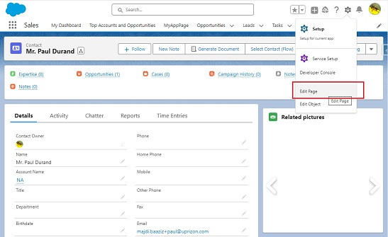
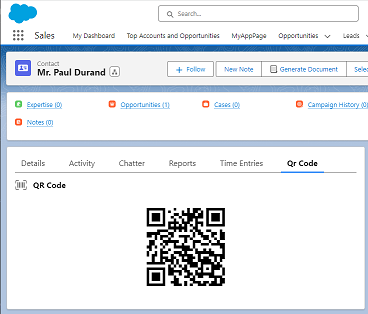

# Configuration du Générateur de Codes QR

**Description**: Le composant Générateur de Codes QR pour Salesforce offre la possibilité de créer des codes QR depuis l'interface Salesforce. Le code QR généré contiendra l'ID de l'enregistrement de l'objet où le composant est placé, facilitant l'accès et le partage des données.

## Installation :

Avant d'utiliser le composant Générateur de Codes QR, assurez-vous que le package Mobee est installé dans votre environnement Salesforce.

## Comment Ajouter le Générateur de Codes QR à une Page d'Objet :

### Instructions Étape par Étape :

1. **Accédez à la Page de l'Objet** : Rendez-vous sur la page d'objet souhaitée où vous souhaitez placer le générateur de codes QR.
2. **Passez en Mode Édition** : Cliquez sur l'option 'Modifier la page', généralement située en haut à droite, pour passer au Lightning App Builder.
3. **Ajoutez le Composant Générateur de Codes QR** :
   - Dans le Lightning App Builder, recherchez la section des composants Lightning dans le volet de gauche.
   - Faites glisser le composant 'generateQrCode' et placez-le à l'emplacement de votre choix sur la mise en page de la page.
4. **Configurez les Attributs du Composant** :
   - Le composant est conçu pour récupérer automatiquement l'ID de l'enregistrement de l'objet où il est placé et l'utiliser pour la génération du code QR. Aucune saisie manuelle n'est nécessaire.
5. **Enregistrez et Activez** : Une fois configuré, enregistrez vos modifications et activez la page pour refléter les modifications dans l'interface Salesforce.

## Exemple d'Utilisation : Génération d'un Code QR pour un Enregistrement de Contact

1. **Accédez à un Contact** : Commencez par accéder à un contact spécifique dans Salesforce pour lequel vous souhaitez un code QR.
2. **Passez en Mode Édition** : Cliquez sur 'Modifier la page'.

    

3. **Insérez le Composant Générateur de Codes QR** :
   - Localisez le composant 'generateQrCode' dans la section du menu de gauche.
   - Faites glisser et déposez-le à l'emplacement souhaité sur la mise en page de la page de compte.

   

4. **Génération du Code QR** :
   - Une fois placé et la page enregistrée, le composant générera automatiquement un code QR contenant l'ID de l'enregistrement de contact.

   

**Remarque** : Assurez-vous d'avoir les autorisations nécessaires pour ajouter des composants aux mises en page de page dans Salesforce.

Bonne génération de codes QR !