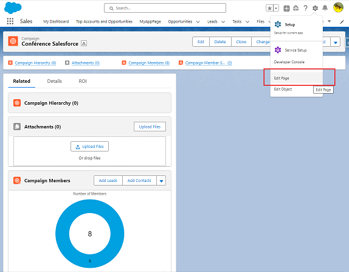
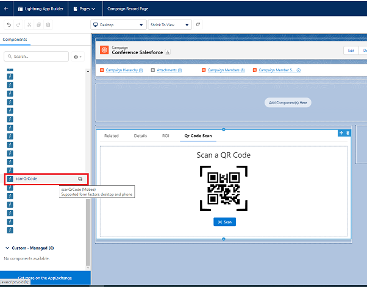
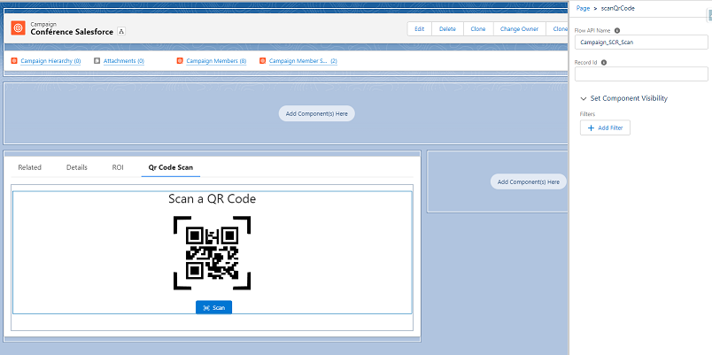
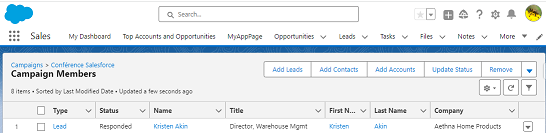
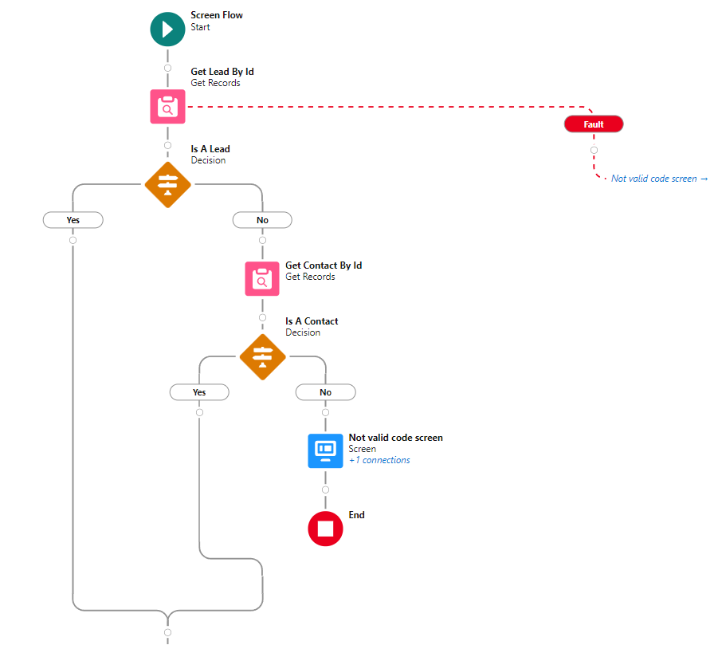
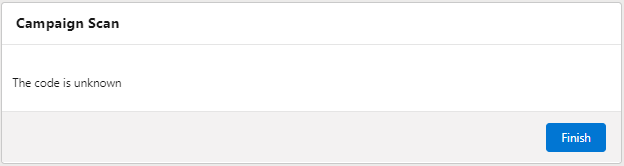
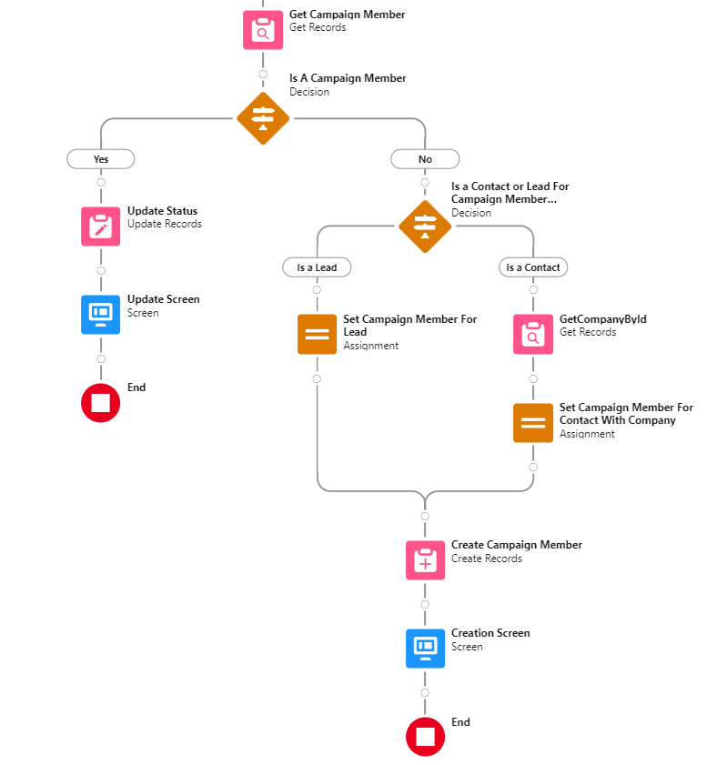

# Configuration du Scanner de Codes QR

**Description** : Le composant Scanner de Codes QR pour Salesforce permet aux utilisateurs de scanner des codes QR directement depuis leur interface Salesforce. En intégrant ce composant, vous pouvez instantanément récupérer et saisir des données, simplifiant diverses tâches manuelles.

## Installation :

Avant d'utiliser le composant Scanner de Codes QR, assurez-vous que le package Mobee est installé dans votre environnement Salesforce.

## Comment Ajouter le Scanner de Codes QR à une Page d'Objet :

### Instructions Étape par Étape :

1. **Accédez à la Page de l'Objet** : Rendez-vous sur la page d'objet souhaitée où vous souhaitez ajouter le scanner de codes QR.
2. **Passez en Mode Édition** : Cliquez sur l'option 'Modifier la page', généralement disponible en haut à droite de l'écran, pour accéder au Lightning App Builder.
3. **Ajoutez le Composant Scanner de Codes QR** :
   - Dans le Lightning App Builder, recherchez la section des composants Lightning dans le volet de gauche.
   - Faites glisser le composant 'scanQrCode' et déposez-le à l'emplacement de votre choix sur la page.
4. **Configurez les Attributs du Composant** :
   - Cliquez sur le composant Scanner de Codes QR ajouté pour afficher ses propriétés.
   - Dans le champ 'Flow API Name', saisissez le nom de l'API du flux souhaité (précédé du préfixe de l'espace de noms si vous utilisez le flux intégré Mobee Campaign Scan). Ce flux sera exécuté lorsque le composant scanne un code QR.
   - L'attribut "Record Id" peut être laissé vide. S'il est laissé vide, il sera automatiquement renseigné avec l'ID de l'enregistrement où le composant est placé.
5. **Enregistrez et Activez** : Une fois terminé, enregistrez les modifications et activez la page pour les refléter dans l'interface Salesforce.

## Exemple d'Utilisation : Ajouter des Contacts ou des Pistes à une Campagne via le Scan de Codes QR

1. **Accédez à la Campagne** : Commencez par accéder à la campagne souhaitée dans Salesforce.
2. **Passez en Mode Édition** : Cliquez sur 'Modifier la page' pour passer au Lightning App Builder.

   

3. **Insérez le Composant Scanner de Codes QR** :
   - Trouvez le composant 'scanQrCode' dans la section 'Personnalisée' à gauche.
   - Faites glisser et placez le composant où vous le souhaitez sur la mise en page de la campagne.

   

4. **Configurez le Composant** : 
   - Cliquez sur le composant pour voir ses attributs.
   - Dans le champ 'Flow API Name', saisissez le nom "Mobee__Campaign_SCR_Scan" (ou le nom du flux associé à la fonction de numérisation pour les campagnes).

   

5. **Effectuez la Numérisation** :
   - Quittez le Lightning App Builder et accédez à la page de la campagne.
   - À l'aide d'un téléphone ou d'un appareil doté d'une caméra, utilisez le composant Scanner de Codes QR pour scanner les codes QR des contacts ou des pistes.

   

6. **Vérification** :
   - Après la numérisation, vérifiez en consultant la liste des membres de la campagne.
   - Assurez-vous que le contact ou la piste numérisé a bien été ajouté à la campagne.

   

**Remarque** : Assurez-vous que le flux ("Mobee__Campaign_SCR_Scan" dans cet exemple) est correctement configuré pour gérer les données des codes QR et effectuer les actions souhaitées dans Salesforce.

## Intégration du Scanner de Codes QR pour la Gestion des Membres d'une Campagne

### **Aperçu**

"Mobee__Campaign_SCR_Scan", fourni en tant que flow modèle dans le package Mobee, s'intègre harmonieusement avec le module de scanner de codes QR. Il facilite l'ajout d'un contact ou d'une Piste à la liste des membres d'une campagne. Conçu comme un modèle, ce flow est hautement adaptable pour répondre à divers besoins.

### **Fonctionnalité du Flow**:

1. **Scan et Identification de l'ID**:
   
   - Après le scan, l'ID est récupéré et stocké dans la variable `scannedId`.
   - Le flow vérifie si ce `scannedId` correspond à une Piste ou un Contact.

2. **Gestion des ID Inconnus**:
   
   - Si le `scannedId` ne correspond pas à une Piste ou Contact, le flow redirige vers un écran affichant un message indiquant que l'ID est inconnu.
   

3. **Vérification de l'Appartenance à la Campagne**:
   
   - Si le `scannedId` est identifié comme une Piste ou un Contact, le flow vérifie ensuite si l'enregistrement en question est déjà membre de la campagne associée au `recordId` (c'est-à-dire la campagne où le module de scan est placé).

4. **Gestion des Informations du Compte du Contact**:
   - Pour les contacts, en raison de la nature hors ligne du scan sur Mobee, le flow récupère manuellement les informations du compte associé en utilisant `GetCompanyById`. Actuellement, en mode hors ligne de Mobee, il existe une limitation où les champs associés intégrés dans les flows Salesforce ne peuvent pas être directement accessibles. Ce problème devrait être résolu dans les prochaines mises à jour.

5. **Ajout à l'Appartenance de la Campagne**:
   - Si la Piste ou le Contact n'est pas un membre de la campagne, ils sont ajoutés à la liste des membres de la campagne.
   - Leur statut est défini sur 'Répondu', bien que cela puisse être personnalisé dans le flow selon les besoins.

6. **Mise à jour du Membre Existante de la Campagne**:
   - Si la Piste ou le Contact est déjà membre de la campagne, leur statut sera mis à jour à 'Répondu'.

Bonne numérisation !