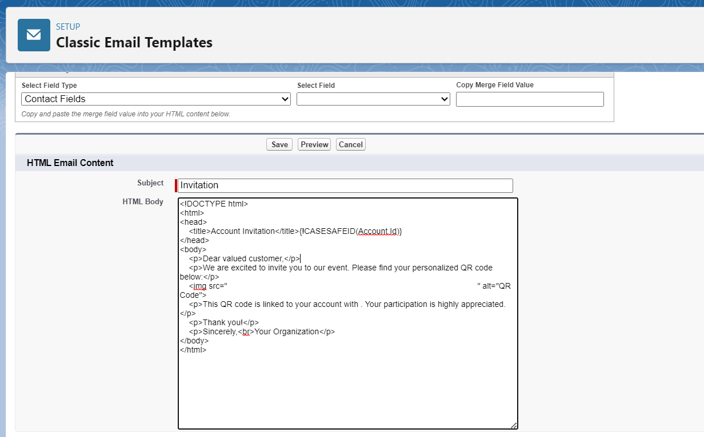

# Modèle d'e-mail personnalisé

Dans cet exemple, nous allons vous guider à travers le processus d'envoi d'un email d'invitation aux clients depuis un compte dans Salesforce. L'email contiendra un code QR personnalisé généré dynamiquement pour chaque destinataire.

**Note**: Bien que cet exemple utilise l'objet "Contact", vous pouvez appliquer la même approche à d'autres objets dans Salesforce.

## Configuration du Modèle d'Email

1. **Type de Modèle** : Personnalisé
2. **En-tête de Lettre Classique** : Non utilisé

## Contenu du Modèle

### Sujet :
```html
Invitation pour {!Contact.Name}
```
### Corps HTML:
```html
<!DOCTYPE html>
<html>
<head>
    <title>Invitation de Compte</title>
</head>
<body>
    <p>Cher client précieux,</p>
    <p>Nous sommes ravis de vous inviter à notre événement. Veuillez trouver ci-dessous votre code QR personnalisé :</p>
    
    <p>Ce code QR est lié à votre compte avec l'ID {!CASESAFEID(Contact.Id)}. Votre participation est grandement appréciée.</p>
    <p>Merci !</p>
    <p>Cordialement,<br>Votre Organisation</p>
</body>
</html>
```
## Aperçu du Corps HTML :



## Email Résultant
Après que le modèle a été traité par Salesforce, l'email sera envoyé aux clients. Voici à quoi pourrait ressembler l'email résultant :

**Résultat de l'Email d'Exemple :**


## Explication

+ Le modèle d'email est configuré en tant que type "Personnalisé", ce qui signifie que vous avez le contrôle sur le contenu et la mise en page.
+ L'en-tête de lettre classique n'est pas utilisé, donc l'email n'aura pas d'en-tête/pied de page prédéfinis depuis un modèle d'en-tête de lettre.
+ Le sujet de l'email est généré dynamiquement en utilisant des champs de fusion. {!Contact.Name} insère le nom du compte dans la ligne de sujet.
+ Le corps HTML de l'email est où réside le contenu principal.
+ La balise img source l'image du code QR depuis une URL. L'URL inclut le champ de fusion CASESAFEID(Contact.Id) pour générer dynamiquement le code QR en fonction de l'ID du compte du destinataire.
+ Un paragraphe sous le code QR explique le but du code QR et son association avec le compte du destinataire.
+ L'email se termine par un message de remerciement et les informations de l'organisation expéditrice.

## Personnalisation

Ce modèle offre une expérience d'invitation personnalisée pour chaque destinataire en incorporant le nom de leur compte et un code QR lié à leur compte spécifique.

Cette approche améliore l'engagement des clients et offre une expérience d'invitation unique grâce aux modèles d'email Salesforce.