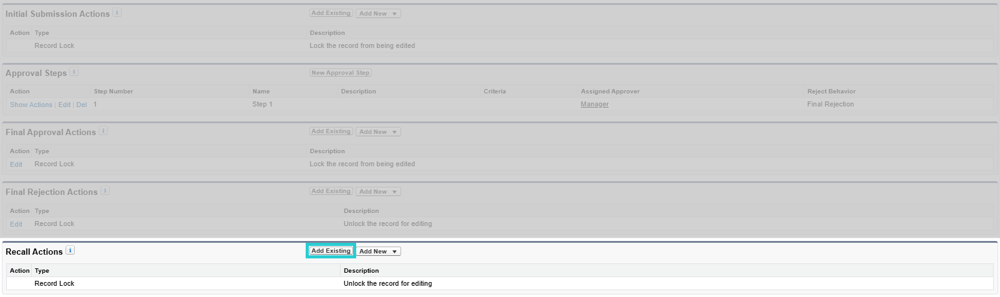
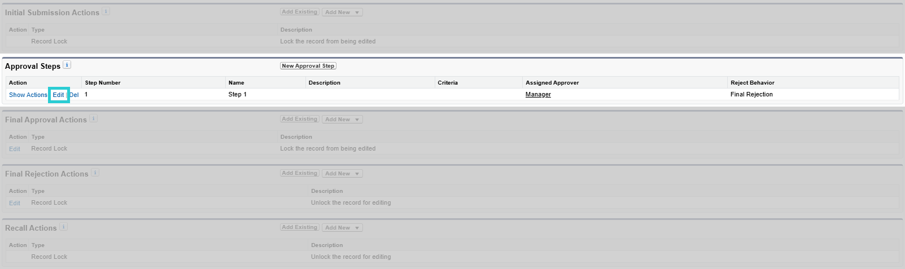
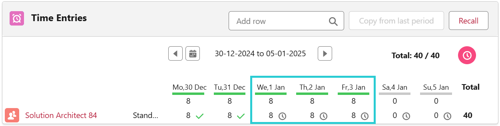

# Processus d'approbation des feuilles de temps

## Introduction

Vous pouvez ajouter un processus d'approbation pour que votre manager, ou un approbateur désigné, examine et approuve ou rejette vos saisies de temps soumises.

  
*Aperçu de la soumission du processus d'approbation*

---

## Activation du processus d'approbation

### 1. Créer le processus d'approbation

La section suivante est un guide étape par étape pour créer un processus d'approbation standard, où certaines actions sont obligatoires et d'autres facultatives. **(Les étapes obligatoires sont mises en gras)**

- Allez sur la page de configuration
- Accédez aux processus d'approbation
- Gérez les processus d'approbation pour : Période de Temps
- Créez un nouveau processus d'approbation : utilisez l'assistant de configuration standard

#### Étape 1 : Entrez le nom et la description

#### Étape 2 : Spécifiez les critères d'entrée

*Aucune action à faire*  

#### Étape 3 : Spécifiez le champ d'approbateur et les propriétés d'édition des enregistrements

1. Spécifiez le champ d'approbateur (pour le routage automatique des approbations)  
   Sélectionnez : *Manager*
   Cette étape est importante uniquement si vous souhaitez désigner le responsable comme approbateur (après avoir terminé la création du processus d'approbation)

2. Édition des enregistrements  
   Sélectionnez : *Les administrateurs ou l'approbateur actuellement assigné peuvent modifier les enregistrements pendant le processus d'approbation.*  

#### Étape 4 : Sélectionnez les modèles de notification

*Aucune action à faire*  

#### Étape 5 : Sélectionnez les champs à afficher sur la mise en page d'approbation

*Aucune action à faire*  

#### Étape 6 : Spécifiez les soumetteurs initiaux

1. Soumetteurs initiaux  
   *Sélectionnez : Propriétaire de la période de temps, créateur de l'enregistrement*

2. **Paramètres de soumission**  
   ***Sélectionnez : Autoriser les soumetteurs à rappeler les demandes d'approbation***  

---

### 2. Gérer le processus d'approbation

Après avoir terminé la création du processus d'approbation, vous pourrez gérer les actions (soumission initiale, approbation finale, rejet final et rappel).

Ces actions doivent être incluses pour que le processus d'approbation fonctionne comme prévu.

  
*Aperçu des actions et des étapes d'approbation*

#### 2.1. Actions de soumission initiale

1. Ajouter existant  
2. Ajouter : *Mise à jour de champ : mettre à jour le statut à soumis (Update Status to Submitted)*

#### 2.2. Actions d'approbation finale

1. Modifier le verrouillage de l'enregistrement et sélectionner : *Déverrouiller l'enregistrement pour modification*  
2. Ajouter existant et ajouter : *Mise à jour de champ : mettre à jour le statut à approuvé (Update Status to Approved)*

#### 2.3. Actions de rejet final

1. Ajouter existant  
2. Ajouter :  
   a. *Mise à jour de champ : mettre à jour le statut à rejeté (Update Status to Rejected)*  
   b. *Alerte e-mail : envoyer une notification par e-mail à l'assigné lors du rejet (Send Email Notification to Assignee on Rejection)* (c'est une alerte e-mail envoyée au soumetteur de la feuille de temps si sa feuille de temps est rejetée par l'approbateur. si elle n'est pas nécessaire, cette alerte e-mail ne doit pas être ajoutée)

#### 2.4. Actions de rappel

1. Ajouter existant  
2. Ajouter : *Mise à jour de champ : mettre à jour le statut à brouillon (Field Update: Update Status to Draft)*

---

### 3. Choisir l'approbateur

#### 3.1. Assigner l'approbateur sur le processus d'approbation

L'approbateur peut être le manager du soumetteur ou un utilisateur spécifique responsable de tous les soumetteurs, tel que le responsable des ressources humaines, garantissant que toutes les feuilles de temps sont dirigées vers un individu pour approbation. Cela est également contrôlé au niveau du processus d'approbation après sa création.

#### 3.2. Affectation des ensembles d'autorisations

Dans configuration > utilisateurs, affectez l'ensemble d'autorisations *Mobee Approve All Timesheets* à l'utilisateur approbateur.

---

## Utilisation du processus d'approbation

#### 1. Soumetteur

L'utilisateur soumet sa feuille de temps pour approbation  
*Cette action est rappelable (1)*  
*Commentaire de soumission (2)*  
*Indicateur de saisies de temps soumises (3)*

#### 2. Approbateur

L'approbateur assigné peut approuver/rejeter sur le contact du soumetteur  
*l'approbateur assigné examine la feuille de temps (saisies de temps soumises) et a l'option d'approuver ou de rejeter la soumission.*

---

## Comportement et considérations du processus d'approbation

- L'approbation partielle est possible

Exemple A :  
*l'utilisateur soumet une demande de congés, qui est approuvée. plus tard, il soumet sa charge de travail assignée pour les jours restants*

  

Exemple B :  
*l'utilisateur soumet les derniers jours du mois pour approbation. le mois suivant, pour la même mission, il soumet les jours de semaine restants pour approbation*

  

- Lorsqu'une feuille de temps est approuvée, une notification est envoyée au soumetteur  
- Lorsqu'une feuille de temps est rejetée, une notification et un e-mail sont envoyés au soumetteur (l'e-mail est envoyé si ajouté selon les actions de rejet final en 2.3.)  
- Lorsque des saisies de temps en attente sur une feuille de temps sont rejetées, la feuille de temps entière devient modifiable  
- En survolant les icônes suivantes ,  et , des commentaires du soumetteur ou de l'approbateur liés à la soumission, à l'approbation ou au rejet sont affichés  
- Les icônes suivantes  et  servent d'indicateurs montrant le statut de l'saisie de temps