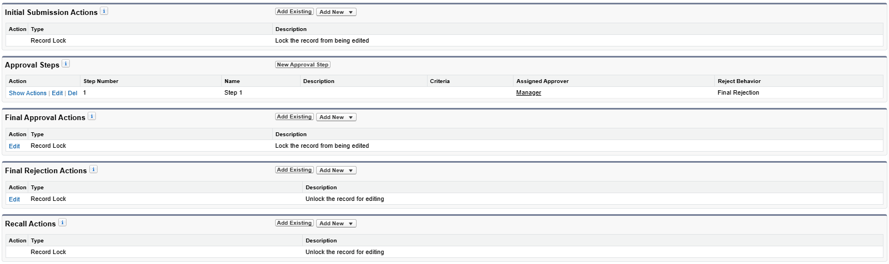
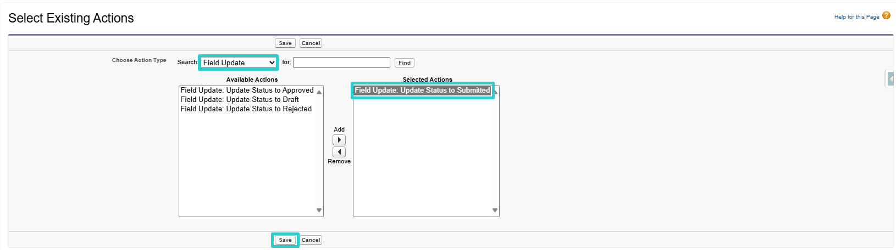

# Processus d'Approbation des Feuilles de Temps

## Introduction

Vous pouvez ajouter un processus d'approbation pour que votre manager, ou un approbateur désigné, examine et approuve ou rejette vos entrées de temps soumises.

*Aperçu de la Soumission du Processus d'Approbation*

---

## Activation du Processus d'Approbation

### 1. Créer le Processus d'Approbation

- Allez à la page de configuration
- Accédez aux Processus d'Approbation
- Gérer les Processus d'Approbation Pour : Période de Temps (Time Period)
- Créer un Nouveau Processus d'Approbation : Utiliser l'Assistant de Configuration Standard

#### Étape 1 : Entrer le Nom et la Description

#### Étape 2 : Spécifier les Critères d'Entrée

**Aucune Action à Faire**

#### Étape 3 : Spécifier le Champ d'Approbateur et les Propriétés d'Éditabilité des Enregistrements

1. **Spécifier le Champ d'Approbateur (Pour le Routage d'Approbation Automatisé)**  
   Sélectionnez : *Manager*

2. **Éditabilité des Enregistrements**  
   Sélectionnez : *Les Administrateurs OU l'approbateur actuellement assigné peuvent éditer les enregistrements pendant le processus d'approbation (Administrators OR the currently assigned approver can edit records during the approval process)*  

#### Étape 4 : Sélectionner les Modèles de Notification

**Aucune Action à Faire**

#### Étape 5 : Sélectionner les Champs à Afficher sur la Mise en Page de la Page d'Approbation

**Aucune Action à Faire**

#### Étape 6 : Spécifier les Soumissionnaires Initiaux

1. **Soumissionnaires Initiaux**  
   Sélectionnez : *Propriétaire de la Période de Temps, Créateur de l'Enregistrement (Time Period Owner, Record Creator)*

2. **Paramètres de Soumission**  
   Sélectionnez : *Autoriser les soumissionnaires à rappeler les demandes d'approbation (Allow submitters to recall approval requests)*  

---

### 2. Gérer le Processus d'Approbation

Après avoir complété la création du processus d'approbation, vous pourrez gérer les actions (Soumission Initiale, Approbation Finale, Rejet Final, et Rappel).

*Aperçu des Actions et des Étapes d'Approbation*

#### 2.1. Actions de Soumission Initiale (Initial Submission Actions)

1. Ajouter Existant (Add Existing)
2. Ajouter : *Mise à Jour de Champ : Update Status to Submitted*

#### 2.2. Actions d'Approbation Finale (Final Approval Actions)

1. Éditer le Verrou d'Enregistrement et Sélectionner : *Déverrouiller l'enregistrement pour édition (Unlock record for editing)*
2. Ajouter Existant (Add Existing) et Ajouter : *Mise à Jour de Champ : Update Status to Approved*

#### 2.3. Actions de Rejet Final (Final Rejection Actions)

1. Ajouter Existant (Add Existing)
2. Ajouter : 
    a. *Mise à Jour de Champ : Update Status to Rejected*
    b. *Alerte par Email : Send Email Notification To Assignee On Rejection* (Ceci est une alerte par email envoyée au soumissionnaire de la feuille de temps si sa feuille de temps est rejetée par l'approbateur. Si ce n'est pas nécessaire, cette alerte par email ne doit pas être ajoutée)

#### 2.4. Actions de Rappel (Recall Actions)

1. Ajouter Existant (Add Existing)
2. Ajouter : *Mise à Jour de Champ : Update Status to Draft*

---

### 3. Choisir l'Approbateur

#### 3.1. Assigner l'Approbateur sur le Processus d'Approbation

L'approbateur peut être le manager du soumissionnaire ou un utilisateur spécifique responsable de tous les soumissionnaires, comme le Responsable des Ressources Humaines, garantissant que toutes les feuilles de temps sont dirigées vers une personne pour approbation. Cela est également contrôlé au niveau du Processus d'Approbation après sa création.

#### 3.2. Attribution de Jeu de Permissions (Permission Set)

Dans Configuration > Utilisateurs, attribuez le jeu de permissions *Mobee Approve All TimeSheets* à l'utilisateur approbateur.

---

## Utilisation du Processus d'Approbation

#### 1. Soumissionnaire
L'utilisateur soumet sa feuille de temps pour approbation
*Cette action est rappelable (1)*
*Commentaire de soumission (2)*
*Indicateur d'entrées de temps soumises (3)*

#### 2. Approbateur
L'approbateur assigné peut approuver/rejeter sur le Contact du Soumissionnaire
*L'approbateur assigné examine la feuille de temps (entrées de temps soumises) et a la possibilité d'approuver ou de rejeter la soumission.*

---

## Comportement et Considérations du Processus d'Approbation

- Une Approbation Partielle est possible

Exemple A :
*L'utilisateur soumet une demande de jours de congé, qui est approuvée. Plus tard, il soumet sa charge de travail assignée pour les jours restants.*

Exemple B : 
*L'utilisateur soumet les derniers jours du mois pour approbation. Le mois suivant, pour la même mission, il soumet les jours de semaine restants pour approbation.*

- Lorsqu'une feuille de temps est approuvée, une notification est envoyée au soumissionnaire

- Lorsqu'une feuille de temps est rejetée, une notification et un email sont envoyés au soumissionnaire (l'email est envoyé s'il a été ajouté selon 2.3. Actions de Rejet Final)

- Lorsque des entrées de temps en attente sur une feuille de temps sont rejetées, l'ensemble de la feuille de temps devient éditable

- En survolant les icônes suivantes ,  et  s'affichent des commentaires du soumissionnaire ou de l'approbateur liés à la soumission, à l'approbation ou au rejet, respectivement

- Les icônes suivantes  et  servent d'indicateurs montrant le statut de l'entrée de temps