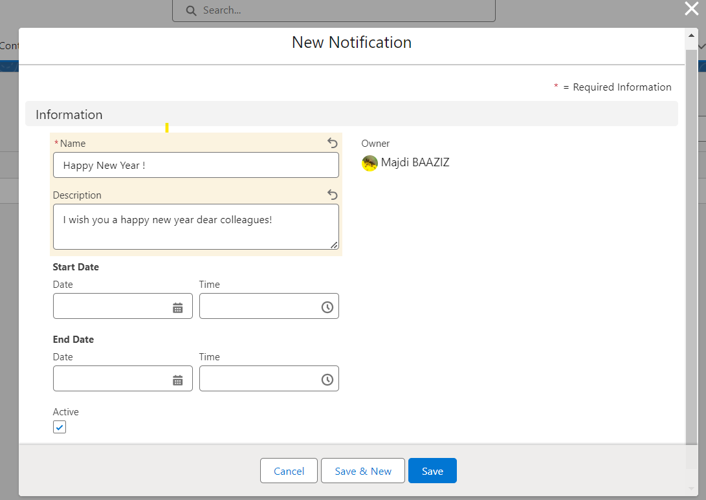

# Dynamic Information Banner LWC Component

## Aperçu

Le composant Lightning Web 'Dynamic Information Banner' offre une fonctionnalité d'affichage de notifications personnalisables au sein des pages d'enregistrement. Il récupère des informations à partir de deux objets personnalisés : 'Notification' et 'Notification Acknowledgement'. Les utilisateurs peuvent créer des notifications avec des attributs spécifiques et les visualiser défilant dans le composant sur la page d'enregistrement. De plus, des options de personnalisation pour la vitesse, la couleur de fond, la couleur de police et le format de notification d'acknowledgment sont disponibles.

### Objets Personnalisés

1. **Notification** :
   - Champs : Nom (obligatoire), Description, Date de Début, Date de Fin, Active (case à cocher)
2. **Notification Acknowledgement** :
   - Champs : Nom, Date/Heure de l'accusé de réception

## Fonctionnalités

- Création de Notifications :

  - Les utilisateurs peuvent créer des notifications avec un nom, une description, une date de début, une date de fin et une case à cocher 'active'.
    
  - La date de début, la date de fin, la description et le statut actif ne sont pas obligatoires.

- Intégration dans la Page d'Enregistrement :
  - Insérez le composant 'Dynamic Information Banner' sur une page d'enregistrement pour afficher les notifications créées qui défilent à l'intérieur du composant.
     
    
     
  - Cliquez sur la notification et reconnaissez-la.
   
- Options de Personnalisation :
  - **Vitesse** : Configurez la vitesse du défilement des notifications en secondes.
  - **Couleur de Fond** : Personnalisez la couleur de fond de la bannière de notification en utilisant le format hexadécimal (par exemple, '#FFFFFF').
  - **Couleur de Police** : Définissez la couleur de police des notifications affichées en utilisant le format hexadécimal.
    
- Format d'Acknowledgment de Notification :
  - Personnalisez le format en utilisant des espaces réservés encapsulés entre crochets ({}) pour les noms de champs de 'Notification Acknowledgement\_\_c'. Les délimiteurs peuvent être n'importe quel caractère ou aucun.

## Utilisation

1. **Insertion du Composant sur la Page d'Enregistrement** :
   - Ajoutez le composant 'Dynamic Information Banner' à une mise en page de page d'enregistrement.

2. **Personnalisation** :
   - Accédez à la page de modification du composant pour personnaliser :
     - La vitesse (en secondes)
     - La couleur de fond (format hexadécimal, par exemple, '#FFFFFF')
     - La couleur de police (format hexadécimal)

## Exemple de Format d'accusé de réception

Un exemple de format de nom d'accusé de réception : '{Mobee\_\_Notification\_\_c}{SystemModstamp}' ou '{Mobee\_\_Notification\_\_c}--{SystemModstamp}'.

- Remplacez 'Mobee\_\_Notification\_\_c' et 'SystemModstamp' par les noms de champs appropriés de 'Notification Acknowledgement\_\_c'.
- Les délimiteurs peuvent être modifiés ou omis selon le format désiré.

## Remarques

- Assurez-vous d'avoir les autorisations d'accès nécessaires pour les objets personnalisés 'Notification' et 'Notification Acknowledgement'.
- Validez les autorisations au niveau des champs et les permissions utilisateur pour les opérations CRUD sur les deux objets.
- Les paramètres de personnalisation pourraient nécessiter une documentation appropriée pour les utilisateurs/administrateurs.
