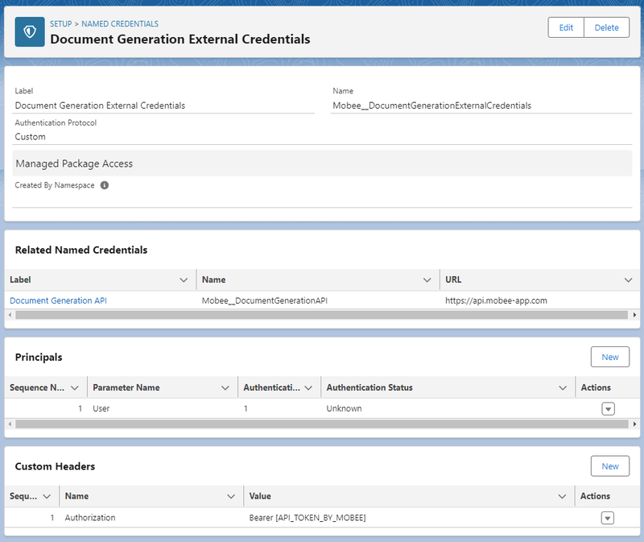

# Configuration des identifiants externes pour le générateur de documents Mobee

Ce document fournit un guide étape par étape sur la configuration des identifiants externes pour le générateur de documents Mobee, y compris la création d'un protocole d'authentification personnalisé, l'ajout de paramètres, d'en-têtes personnalisés et l'intégration avec Uprizon pour l'authentification.

## Configuration des identifiants externes

1. Ouvrez l'interface de gestion des identifiants externes en accédant à **Configuration** > **Sécurité** > **Identifiants nommés**.

   

2. Cliquez sur l'onglet "Identifiants externes".

   

3. Localisez l'identifiant externe portant le libellé "Document Generation External Credentials" et cliquez dessus.

   

4. À l'intérieur de "Document Generation External Credentials", trouvez le principe avec le nom de paramètre "user". Cliquez sur la flèche à droite et sélectionnez "Modifier".

   

   

   

5. À l'intérieur de la fenêtre des principaux, ajoutez des paramètres d'authentification :
    - Cliquez sur le bouton "Ajouter" à côté des Paramètres d'authentification.
    - Dans la section Paramètre 1, ajoutez :
        - **Nom :** Autorisation
        - **Valeur :** [Jeton fourni par Mobee]

          **Note :** Avant de sauvegarder, assurez-vous que le jeton a le préfixe "Bearer ". Sinon, ajoutez le préfixe avec un espace. 
          
            Par exemple : Si le jeton est `3259eae457d982a08f72d91e72d64903aa87fc164dcfcf244b4fb2840403c2af`, faites-le : `Bearer 3259eae457d982a08f72d91e72d64903aa87fc164dcfcf244b4fb2840403c2af`
    - Cliquez sur "Enregistrer" pour sauvegarder les modifications.

   

6. Dans "Document Generation External Credentials", accédez à la section En-têtes personnalisés et cliquez sur "Nouveau" pour ajouter un nouvel en-tête personnalisé.

   

7. À l'intérieur de la fenêtre des En-têtes personnalisés, ajoutez un nouvel en-tête personnalisé.
    - Ajoutez :
        - **Nom :** Autorisation
        - **Valeur :** [Jeton fourni par Mobee]

          **Note :** Avant de sauvegarder, assurez-vous que le jeton a le préfixe "Bearer ". Sinon, ajoutez le préfixe avec un espace. 
          
            Par exemple : Si le jeton est `3259eae457d982a08f72d91e72d64903aa87fc164dcfcf244b4fb2840403c2af`, faites-le : `Bearer 3259eae457d982a08f72d91e72d64903aa87fc164dcfcf244b4fb2840403c2af`
    - Cliquez sur "Enregistrer" pour sauvegarder l'en-tête personnalisé.

   

8. Vous avez maintenant terminé la configuration des identifiants externes pour le générateur de documents Mobee.

   Assurez-vous que lorsque le jeton fourni par Mobee est mis à jour, vous devez mettre à jour le jeton dans les Paramètres d'authentification et les En-têtes personnalisés.

## Conclusion

En suivant ces étapes, vous avez configuré avec succès des identifiants externes pour le générateur de documents Mobee avec une authentification personnalisée, des en-têtes personnalisés et une intégration avec Uprizon pour une authentification sécurisée. Les utilisateurs avec l'ensemble d'autorisations approprié peuvent maintenant accéder sans problème à l'API du générateur de documents Mobee.
