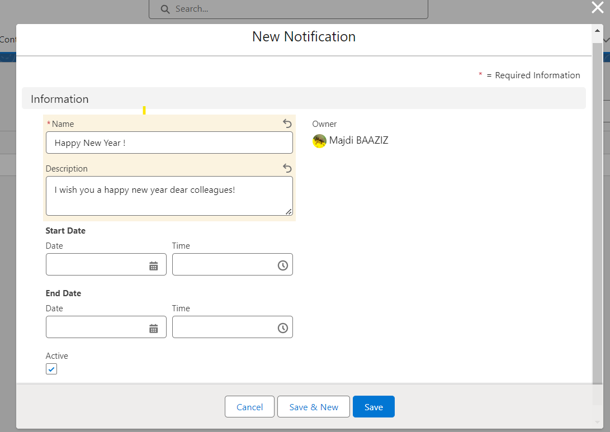

# Composant de bannière de notifications

## Aperçu

Le composant Lightning Web Component (LWC) 'Notifications Banner' fournit une fonctionnalité d'affichage de notifications personnalisable au sein des pages d'enregistrement. Il récupère des informations à partir de deux objets personnalisés : 'Notification' et 'Notification Acknowledgement'. Les utilisateurs peuvent créer des notifications avec des attributs spécifiques et les visualiser en les faisant glisser dans le composant placé sur la page Lightning désirée. De plus, des options de personnalisation telles que la vitesse, la couleur de fond, la couleur de la police et le format de notification d'acquittement sont disponibles.

### Objets personnalisés

1. **Notification** :
   - Champs : Nom (obligatoire), Description, Date de début, Date de fin, Actif (case à cocher)
2. **Notification Acknowledgement** :
   - Champs : Date/Heure de l'acquittement, Acquitté par

## Fonctionnalités

### Création de notifications :

Les utilisateurs peuvent créer de nouvelles notifications en fournissant un nom qui sera affiché comme titre, une description, une date de début, une date de fin et en indiquant si elle est active ou non.

**Note** : La date de début, la date de fin, la description et le statut actif ne sont pas des champs obligatoires.

### Intégration dans la page d'enregistrement :

Insérez le composant 'Notifications Banner' sur une page Lightning pour afficher les notifications créées qui défilent à l'intérieur du composant.

Cliquez sur la notification et acquittez-la.

### Options de personnalisation :

- `Vitesse de notification` : Ce paramètre contrôle la vitesse à laquelle les textes des notifications défilent sur l'écran. Si vous saisissez une valeur plus élevée, les notifications se déplaceront plus rapidement.
- `Couleur de fond` : Personnalisez la couleur de fond de la bannière de notification en utilisant le format hexadécimal (par exemple, '#FFFFFF').
- `Couleur de la police de notification` : Définissez la couleur de la police pour les notifications affichées en utilisant le format hexadécimal.

- `Format du nom de l'acquittement de la notification` : Personnalisez le format en utilisant des espaces réservés entre crochets (`{}`) pour les noms de champ de `Notification Acknowledgement__c`. Les délimiteurs peuvent être n'importe quel caractère ou aucun.

## Utilisation

### Insertion du composant sur une page Lightning :

Ajoutez le composant LWC 'Notifications Banner' à une mise en page de page d'enregistrement.

### Personnalisations :

Dans le Lightning Page Builder, vous pouvez accéder à ses propriétés en cliquant sur le composant pour personnaliser les éléments suivants :
- Vitesse de défilement
- Couleur de fond
- Couleur de la police

### Exemple de format d'acquittement

Un exemple de format d'acquittement : `{Mobee__Notification__c}{SystemModstamp}` ou `{Mobee__Notification__c}--{SystemModstamp}`.

- Remplacez `Mobee__Notification__c` et `SystemModstamp` par les noms de champ appropriés de `Notification Acknowledgement__c`.
- Les délimiteurs peuvent être modifiés ou omis selon le format souhaité.

## Remarques

- Assurez-vous d'avoir les autorisations d'accès nécessaires pour les objets personnalisés **Notification** et **Notification Acknowledgement**.
- Validez la sécurité au niveau des champs et les autorisations utilisateur pour les opérations CRUD sur les deux objets.
- Les paramètres de personnalisation peuvent nécessiter une documentation appropriée pour les utilisateurs/administrateurs.