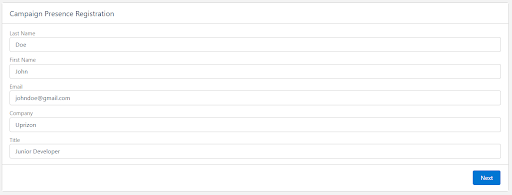

# Inscription pour participer à la campagne

Optimiser la Gestion des Membres de Campagne avec le Flux

### **Aperçu**

Le flux "Campaign Presence Registration" est conçu pour faciliter et optimiser le processus d'ajout ou de mise à jour des membres dans une campagne Salesforce. En offrant une interface utilisateur conviviale et entièrement personnalisable, ce flux guide systématiquement l'utilisateur à travers le processus de vérification, mise à jour, et gestion du contact ou du lead associé, assurant ainsi une exactitude des données et une interaction enrichie avec les utilisateurs.

### **Objectif**

L’objectif principal du flux "Campaign Presence Registration" est de fournir une gestion fluide des membres de campagne en utilisant une adresse mail comme donnée clé. En plus de renforcer l'interaction utilisateur dans la gestion des campagnes avec des options pour vérifier, mettre à jour, ou créer des dossiers, il veille à ce que chaque interaction soit valorisée efficacement pour la gestion des membres de la campagne.

### **Personnalisation Complète Selon les Besoins Utilisateur**

Ce flux offre une flexibilité totale en termes de personnalisation, permettant de l'adapter aux besoins spécifiques des utilisateurs et des organisations. Il répond non seulement aux cas d’utilisation fondamentaux liés à l’ajout et à la mise à jour des membres d’une campagne, mais offre également un espace pour :
- Intégrer des champs de mise à jour supplémentaires.
- Appliquer une logique personnalisée pour la mise à jour du statut des membres de la campagne.
- Personnaliser les écrans d'interaction utilisateur pour une meilleure expérience.
- Incorporer des vérifications ou procédures supplémentaires en fonction des workfluxs de l'entreprise.

### **Fonctionnalité du Flux**

1. **Saisie de l'Adresse Mail**:
   - Le flux débute par la réception d’une adresse mail en tant qu’entrée.
   - Celle-ci est utilisée pour récupérer les données associées et exécuter les actions suivantes.  

   
2. **Identification du Contact ou du Lead**:
   - Le flux cherche à identifier si l'adresse mail correspond à un Lead ou un Contact dans Salesforce.
   
3. **Interaction de Mise à Jour des Données**:
   - Si l’adresse mail est liée à un Lead ou Contact existant, l’utilisateur est sollicité pour mettre à jour certains champs :
     - Pour les Leads : Nom de Famille, Prénom, Email, Entreprise et Titre.  
     
     
     - Pour les Contacts : Nom de Famille, Prénom et Email.  

       

   - Note : La mise à jour de 'l'Entreprise' pour les Contacts est délibérément exclue en raison de sa relation avec l’objet Account et devra être modifiée directement dans Salesforce si nécessaire.

4. **Création d’un Lead pour une Adresse Mail Inconnue**:
   - Si l’adresse mail ne correspond pas à un Lead ou Contact existant, l'utilisateur a l’option de créer un nouveau Lead.
   - L’utilisateur peut renseigner les informations pertinentes, telles que Nom de Famille, Prénom, Email, Entreprise et Titre, pour établir un nouveau record Lead.  

   

5. **Gestion des Membres de Campagne**:
   - Après la mise à jour des données ou la création du Lead, le flux vérifie si le Contact ou Lead est déjà membre de la campagne identifiée par `recordId`.
   - S’il n’est pas membre, l'individu est ajouté à la campagne et son statut de membre est initialisé (ex : 'Répondu').
   - S’il est déjà membre, le statut est mis à jour en conséquence.  

   

Le flux "Campaign Presence Registration" assure une gestion structurée et efficace des adhésions aux campagnes tout en conservant la flexibilité nécessaire pour ajuster le flux en fonction des besoins commerciaux évolutifs et en veillant à ce qu'aucun lead potentiel ne soit perdu dans le processus.
