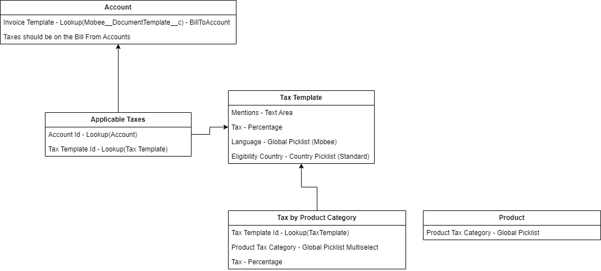

# Introduction

Le **Module Mobee de Facturation et de Gestion des Factures** utilise plusieurs objets personnalisés pour gérer efficacement les factures, les lignes de facture et les taxes. Cela garantit une facturation précise, un calcul des taxes et une flexibilité de reporting dans différents scénarios d'affaires. Les objets personnalisés se divisent en deux catégories :

- **Objets Principaux** : Ils représentent les composants principaux de la facturation, tels que **Facture** et **Élément de ligne de facture**.
- **Objets Liés aux Taxes** : Ils gèrent les règles fiscales et les calculs, incluant **Modèle de Taxe**, **Taxe par Catégorie de Produit** et **Taxes Applicables**.

---

# Objets Principaux

## Facture

L'objet **Facture** est l'enregistrement principal pour la facturation. Il stocke des détails tels que le client, le montant dû, et le statut de la facture. Il se lie également à des enregistrements connexes tels que des Opportunités, des Commandes ou des Projets.

### Informations Clés :
- **Compte à facturer (Lookup - Compte) :** Le compte à facturer pour la facture.
- **Contact à facturer (Lookup - Contact) :** Le contact responsable de recevoir la facture.
- **Client (Lookup - Compte) :** Le compte lié à cette facture.
- **Compte de facturation (Lookup - Compte) :** Le compte à qui le paiement de la facture est dû.
- **Devise (Picklist) :** Spécifie la devise utilisée pour la facture.
- **Date d'échéance (Date) :** La date à laquelle le paiement de la facture est attendu.
- **Montant total (Formule - Devise) :** Le montant total dû, calculé comme un regroupement de toutes les **Éléments de ligne de facture** associées.
- **Montant des taxes (Récapitulatif - Devise) :** Le montant total des taxes pour la facture, calculé à partir des **Éléments de ligne de facture** associées.
- **Date d'émission (Date) :** La date de génération de la facture.
- **Numéro de facture (Texte) :** Un identifiant unique pour la facture.
- **Opportunité (Lookup - Opportunité) :** Lien vers l'opportunité associée à la facture (si applicable).
- **Projet (Lookup - Projet) :** Lien vers le projet associé à la facture (si applicable).
- **Modèle de Taxe (Lookup - Modèle de Taxe) :** Lien vers le **Modèle de Taxe** utilisé pour appliquer les taux de taxe à la facture.

### Utilisation :
L'enregistrement **Facture** est utilisé pour suivre la facturation et les paiements. Il récupère des informations des **Éléments de ligne de facture** pour le montant total et les taxes. Les factures peuvent être créées à partir d'Opportunités, de Commandes, de Projets ou d'Assignations.

---

## Élément de ligne de facture

L'objet **Élément de ligne de facture** représente chaque produit ou service facturé dans une facture. Il inclut les informations de prix, de quantité et de taxes.

### Informations Clés :
- **Produit (Lookup - Produit) :** Le produit ou service facturé dans cette ligne.
- **Quantité (Nombre) :** La quantité du produit ou service facturé.
- **Prix unitaire (Devise) :** Le prix par unité du produit ou service.
- **% de remise (Pourcentage) :** Toute réduction appliquée à la ligne, exprimée en pourcentage.
- **Montant total (Formule - Devise) :** Le montant total pour cette ligne, calculé comme **Quantité × Prix unitaire** moins les réductions.
- **Taxes - Taux (Pourcentage) :** Le taux de taxe appliqué à cette ligne.
- **Taxes - Montant (Formule - Devise) :** Le montant total de la taxe pour cette ligne, calculé comme **Montant total × Taxes - Taux**.
- **Montant (HT) (Formule - Devise) :** Le montant total avant taxes, calculé comme **Quantité × Prix unitaire** moins les réductions.
- **Devise (Picklist) :** La devise utilisée pour cette ligne.
- **Date de début (Date) :** La date de début du service ou produit facturé.
- **Date de fin (Date) :** La date de fin du service ou produit facturé.
- **Facture (Relation Hiérarchique - Facture) :** La facture parente à laquelle cette ligne appartient.

### Utilisation :
Chaque **Élément de ligne de facture** détaille ce qui est facturé et calcule le total pour cet élément, y compris les taxes et réductions. Ces éléments s'additionnent pour former le montant total dû sur la facture.

---

# Objets Liés aux Taxes

Ces objets définissent les règles fiscales en fonction des catégories de produits, des comptes et des régions.

## Modèle de Taxe

L'objet **Modèle de Taxe** définit comment les taxes sont appliquées aux factures, y compris le taux de taxe et la région.

### Informations Clés :
- **Taux de Taxe** : Le pourcentage de taxe à appliquer.
- **Langue et Pays** : Spécifie la langue et le pays auxquels la taxe s'applique.
- **Mentions Légales** : Tout texte légal ou lié aux taxes à afficher sur la facture.

### Utilisation :
1. **Récupération des Modèles Fiscaux liés au Compte Bill From** :
   - Commencez par récupérer tous les **Modèles Fiscaux** associés au **Compte Bill From**.

2. **Identification du bon Modèle Fiscal** :
   - **Correspondance de la langue** : Associez la **Langue** provenant du **Compte Bill To** -> **Mobee Document Template** -> **Langue**.
   - **Correspondance du pays** : Associez le **Pays** provenant du **Compte Bill To** -> **Pays de facturation (Billing Country)**.

3. **Application du Modèle Fiscal** :
   - Une fois le bon **Modèle Fiscal** identifié, appliquez-le à la facture pour garantir que les règles fiscales appropriées sont respectées.

---

## Taxe par Catégorie de Produit

L'objet **Taxe par Catégorie de Produit** garantit que les produits sont taxés correctement en fonction de leur catégorie.

### Informations Clés :
- **Catégorie de Produit** : Le type de produit facturé.
- **Taux de Taxe** : Le taux de taxe pour cette catégorie.

### Utilisation :
Lors de la facturation de produits depuis une **Opportunité** ou une **Commande**, le processus est le suivant :

1. **Récupération du bon Modèle Fiscal** :
   - Utilisez le même processus pour récupérer le bon **Modèle Fiscal**, basé sur le **Compte Bill From** et en associant la **Langue** et le **Pays** du **Compte Bill To**.

2. **Vérification des Taxes par Catégorie de Produit** :
   - Pour chaque **Produit de l'Opportunité** ou **Produit de la Commande**, vérifiez le champ personnalisé **Catégorie de Taxe** (Picklist).
   - Comparez cette valeur avec le champ **Catégorie de Produit Fiscal** dans l'objet **Taxe par Catégorie de Produit**.
   - Assurez-vous que la **Taxe par Catégorie de Produit** est liée au même **Modèle Fiscal** identifié précédemment.

3. **Application de la Taxe** :
   - **Si une correspondance est trouvée** :
     - Utilisez le **Taux de Taxe** correspondant.
   - **Si aucune correspondance n'est trouvée** :
     - Appliquez le taux de taxe défini dans le **Modèle Fiscal**.

4. **Répétition pour chaque produit** :
   - Répétez ce processus pour chaque produit afin de garantir une taxation correcte.

---

## Taxes Applicables

L'objet **Taxes Applicables** relie les règles fiscales à des comptes spécifiques, garantissant que la bonne taxe est appliquée en fonction de la localisation du compte.

### Informations Clés :
- **Compte** : Le compte auquel les règles fiscales s'appliquent.
- **Modèle de Taxe** : Le modèle utilisé pour calculer les taxes pour ce compte.

### Utilisation :
Le système trouve le modèle de taxe correct en fonction du pays du compte et l'applique aux factures.

---
