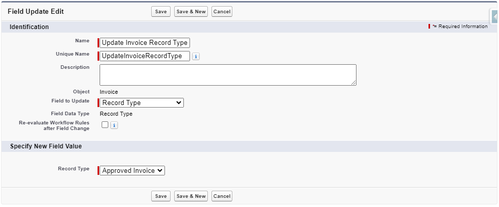

# Configuration et Paramétrage pour la Facturation

Cette section vous guidera dans la configuration des fonctionnalités clés telles que le processus d'approbation, l'ajout du bouton "Générer une Facture", la configuration des affectations de pages Lightning, la gestion des autorisations des utilisateurs et des administrateurs, ainsi que l'attribution des types d'enregistrement aux profils.

## Gestion des Jeux d'Autorisations Personnalisés

Deux jeux d'autorisations personnalisés sont fournis dans le package pour contrôler l'accès aux fonctionnalités de facturation :

1. **Administrateur Mobee Facturation**
2. **Utilisateur Mobee Facturation**

Ces jeux d'autorisations définissent les niveaux d'accès pour différents types d'utilisateurs, garantissant que les administrateurs peuvent gérer pleinement les opérations de facturation, tandis que les utilisateurs standard ont un accès restreint en lecture seule avec la possibilité de générer des factures via un Flow.

### **Administrateur Mobee Facturation**

Le jeu d'autorisations **Administrateur Mobee Facturation** est destiné aux administrateurs responsables de la gestion du processus de facturation, des modèles et de la configuration. Les administrateurs ont un contrôle total sur tous les objets et flows liés à la facturation.

#### Autorisations :
- **Lecture/Écriture** sur tous les objets personnalisés liés à la facturation, y compris :
  - **Facture**
  - **Élément de Ligne de Facture**
  - **Modèle de Taxe**
  - **Taxe par Catégorie de Produit**
  - **Taxes Applicables**
- **Contrôle total** des flows liés à la facturation :
  - Les administrateurs peuvent créer, modifier et supprimer les **Flows Modèles** utilisés pour générer des factures.

#### Utilisation :
- Le jeu d'autorisations **Administrateur Mobee Facturation** est attribué aux utilisateurs qui doivent gérer tous les aspects de la facturation, y compris la personnalisation des flows de génération de factures et la gestion des paramètres fiscaux. Ce rôle convient aux équipes financières et opérationnelles responsables de la supervision du processus de facturation.

---

### **Utilisateur Mobee Facturation**

Le jeu d'autorisations **Utilisateur Mobee Facturation** est destiné aux utilisateurs standard qui interagissent avec le processus de facturation mais ne nécessitent pas un accès administratif complet. Les utilisateurs disposant de cette autorisation peuvent générer des factures via un Flow mais ne peuvent pas modifier les modèles ou les paramètres de configuration de la facturation.

#### Autorisations :
- **Accès en Lecture seule** sur tous les objets personnalisés liés à la facturation, y compris :
  - **Facture**
  - **Élément de Ligne de Facture**
  - **Modèle de Taxe**
  - **Taxe par Catégorie de Produit**
  - **Taxes Applicables**
- **Accès Flow** : Les utilisateurs peuvent accéder au Flow et l'utiliser pour créer et soumettre des factures, mais ils ne peuvent pas modifier la configuration ou les modèles de Flow.

#### Utilisation :
- Le jeu d'autorisations **Utilisateur Mobee Facturation** est conçu pour les membres des équipes commerciales, de service ou de projet qui doivent générer des factures mais ne gèrent pas le système de facturation. Ce rôle permet aux utilisateurs d'interagir avec le Flow de facturation tout en maintenant un contrôle strict sur les données et configurations liées à la facturation.

---

## Attribution des Jeux d'Autorisations aux Utilisateurs

Les jeux d'autorisations personnalisés sont déjà inclus dans le package **Mobee Facturation**. Suivez ces étapes pour les attribuer aux utilisateurs :

### Attribuer le Jeu d'Autorisations Administrateur Mobee Facturation :

1. **Accédez à Configuration** > **Jeux d'Autorisations**.
2. Recherchez le jeu d'autorisations : `Administrateur Mobee Facturation`.
3. Cliquez sur le jeu d'autorisations et sélectionnez **Gérer les Attributions**.
4. Cliquez sur **Ajouter des Attributions**.
5. Sélectionnez les utilisateurs qui ont besoin d'un accès **administrateur** au système de facturation.
6. Cliquez sur **Attribuer**.

### Attribuer le Jeu d'Autorisations Utilisateur Mobee Facturation :

1. **Accédez à Configuration** > **Jeux d'Autorisations**.
2. Recherchez le jeu d'autorisations : `Utilisateur Mobee Facturation`.
3. Cliquez sur le jeu d'autorisations et sélectionnez **Gérer les Attributions**.
4. Cliquez sur **Ajouter des Attributions**.
5. Sélectionnez les utilisateurs qui ont besoin d'un accès **utilisateur** pour interagir avec le Flow de facturation.
6. Cliquez sur **Attribuer**.

---

## Attribution des Types d'Enregistrement aux Profils

Pour garantir un accès approprié à des types d'enregistrement spécifiques, suivez ces étapes pour configurer l'accès aux types d'enregistrement pour les profils utilisateur :

1. **Accédez à Configuration** > **Profils**.
2. Sélectionnez le profil pour lequel vous souhaitez attribuer des autorisations de Type d'Enregistrement.
3. Dans la section **Paramètres des Types d'Enregistrement**, trouvez l'objet **Facture**.
4. Cliquez sur **Modifier** à côté de l'objet **Facture**.
5. Sélectionnez les Types d'Enregistrement appropriés (par exemple, **Facture Approuvée**, **Facture Brouillon**) qui doivent être disponibles pour le profil.
6. Définissez un **Type d'Enregistrement par Défaut** pour ce profil.
7. Cliquez sur **Enregistrer**.

Cette configuration garantit que les utilisateurs disposant de profils spécifiques peuvent accéder et travailler avec les types d'enregistrement pertinents pour l'objet **Facture**.

---

## Attribution des Pages Lightning pour les Factures

Le **Module Mobee Facturation** inclut deux **Pages Lightning** pour les factures, permettant d'avoir des mises en page distinctes selon le statut de la facture. Cependant, en raison des limites du package, l'attribution de ces pages à des types d'enregistrement spécifiques doit être effectuée manuellement. Cette section explique comment attribuer les pages Lightning correctement.

---

### Pages Lightning Disponibles

1. **Mobee Facture Approuvée (Page Lightning)** : Cette mise en page est conçue pour les factures ayant le type d'enregistrement **Facture Approuvée**.
2. **Mobee Facture Brouillon (Page Lightning)** : Cette mise en page est conçue pour les factures ayant le type d'enregistrement **Facture Brouillon**.

#### Important :
Les attributions de pages ne sont pas automatiquement gérées par le package, une configuration manuelle est donc requise pour s'assurer que les mises en page correctes sont appliquées en fonction du statut de la facture.

---

### Attribution Manuelle des Pages Lightning

#### Attribuer la **Page Mobee Facture Approuvée** au Type d'Enregistrement **Facture Approuvée** :

1. **Accédez à Configuration** > **Gestionnaire d'Objets**.
2. Recherchez et sélectionnez l'objet **Facture**.
3. Dans le menu de gauche, cliquez sur **Pages Lightning**.
4. Recherchez la page appelée **Mobee Facture Approuvée**.
5. Cliquez sur **Voir les Attributions** ou **Attribuer comme Valeur par Défaut**.
6. Sélectionnez **Application, Type d'Enregistrement, et Profil** dans la liste d'attribution.
7. Choisissez **Facture Approuvée** comme Type d'Enregistrement.
8. Cliquez sur **Enregistrer**.

#### Attribuer la **Page Mobee Facture Brouillon** au Type d'Enregistrement **Facture Brouillon** :

1. **Accédez à Configuration** > **Gestionnaire d'Objets**.
2. Recherchez et sélectionnez l'objet **Facture**.
3. Dans le menu de gauche, cliquez sur **Pages Lightning**.
4. Recherchez la page appelée **Mobee Facture Brouillon**.
5. Cliquez sur **Voir les Attributions** ou **Attribuer comme Valeur par Défaut**.
6. Sélectionnez **Application, Type d'Enregistrement, et Profil** dans la liste d'attribution.
7. Choisissez **Facture Brouillon** comme Type d'Enregistrement.
8. Cliquez sur **Enregistrer**.

En suivant ces étapes, vous vous assurez que les **Pages Lightning** appropriées sont attribuées aux types d'enregistrement corrects pour les factures, offrant des vues claires et distinctes selon les statuts des factures.

---

## Ajout du bouton **Nouvelle facture** à la page

Pour simplifier le processus de facturation, vous pouvez ajouter un bouton **Nouvelle facture** aux dispositions de page concernées, permettant aux utilisateurs de créer rapidement des factures via un flux.

Suivez les étapes ci-dessous pour ajouter le bouton **Nouvelle facture**.

---

### Ajouter le bouton **Nouvelle facture** à la disposition de la page

1. Dans le panneau de gauche, sélectionnez **Dispositions de page**.
2. Choisissez la disposition de page où vous souhaitez ajouter le bouton **Nouvelle facture** (par exemple, la disposition Opportunité).
3. Dans l'éditeur de disposition, descendez jusqu'à la section **Actions pour Salesforce Mobile et Lightning Experience**.
4. Faites glisser le bouton **Nouvelle facture** depuis le panneau vers la section **Actions pour Salesforce Mobile et Lightning Experience**.
5. Cliquez sur **Enregistrer**.

---

En suivant ces étapes, vous aurez un bouton **Nouvelle facture** sur votre page, offrant aux utilisateurs un moyen simple de lancer le processus de création de factures via le flux associé.

---

## Configuration du processus d’approbation pour l’objet Facture

Un processus d’approbation pour les factures garantit que chaque facture suit un workflow cohérent de révision et d’approbation. Dans cette section, nous vous guiderons à travers la configuration du processus d’approbation à l’aide de l’assistant de processus d’approbation de Salesforce, avec des détails pour chaque étape.

---

### Étape 1 : Création du processus d’approbation avec l’assistant

1. **Accédez à Configuration** > **Processus d’approbation**.
2. Dans l’**Assistant de démarrage**, choisissez **Créer un nouveau processus d’approbation**.
3. Sélectionnez l’objet **Facture**.
4. **Saisissez le nom du processus d’approbation** (par exemple, "Processus d’approbation des factures") et fournissez une description.
5. **Définissez les critères d’entrée** :
   - Configurez les conditions qui déterminent quand une facture entre dans le processus d’approbation (par exemple, utilisez **La formule évalue à vrai** et définissez la formule pour déclencher le processus lorsque le statut est **Brouillon** : `ISPICKVAL(Status__c, 'Draft')`).

      

6. Cliquez sur **Suivant** pour continuer la configuration du processus d’approbation.

---

### Étape 2 : Définir les actions de soumission initiale

1. Dans **Actions de soumission initiale**, choisissez **Ajouter une nouvelle action** > **Mise à jour de champ** pour mettre à jour le statut de la facture en **Soumise pour approbation**.

2. Sélectionnez **Mise à jour de champ** dans le menu déroulant des types d’actions.

   

3. Créez la **Mise à jour de champ** pour changer le champ **Statut** de la facture en **Soumise pour approbation**.

   

4. Enregistrez vos modifications pour finaliser la configuration des **Actions de soumission initiale**.

---

Cette étape configure le verrouillage de l’enregistrement et la mise à jour du statut de la facture lors de la soumission initiale pour approbation.

---

### Étape 3 : Actions finales d’approbation

Pour les **Actions finales d’approbation**, vous configurerez les étapes qui se produisent lorsqu’une facture est approuvée.

1. Créez une **Mise à jour de champ** pour changer le **Type d’enregistrement de la facture** en **Facture approuvée**.

   

2. Créez une **Mise à jour de champ** pour changer le **Statut** de la facture en **Approuvée**.

   

---

Cette étape configure le déverrouillage de l’enregistrement, la mise à jour du type d’enregistrement et le marquage de la facture comme approuvée lors de l’approbation finale.

---

### Étape 4 : Définir les actions de rejet et de rappel

1. Dans les **Actions de rejet**, configurez ce qui se passe si la facture est rejetée :
   - **Mise à jour de champ** : Définissez le **Statut de la facture** sur **Brouillon**.
   
   
   
2. De même, configurez les **Actions de rappel** pour mettre à jour le statut de la facture en **Brouillon** lorsqu’une action de rappel est effectuée.

   

---

### Étape finale : Activer le processus d’approbation

1. Après avoir configuré les actions de soumission initiale, d’approbation, de rejet et de rappel, passez en revue les paramètres de votre processus d’approbation.
2. Cliquez sur **Activer** pour rendre le processus d’approbation actif pour l’objet **Facture**.

---

En suivant ces étapes, vous aurez un processus d’approbation entièrement fonctionnel pour les factures, garantissant que celles-ci passent par des révisions appropriées et des modifications de statut en fonction des résultats de l’approbation.

