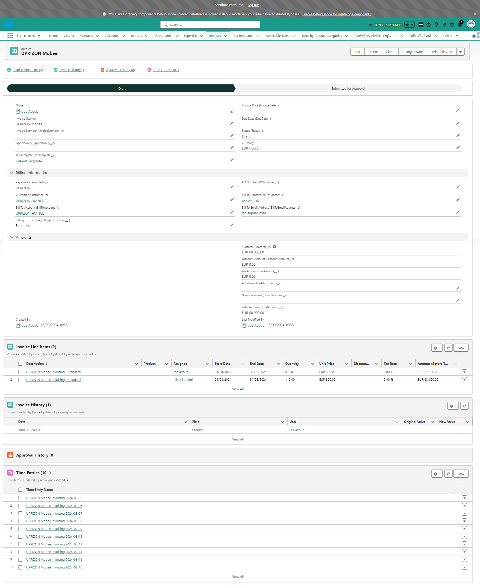

# Utilisation du Module Mobee de Facturation et Gestion des Factures

Ce guide vous explique comment générer une facture à partir d’un **Projet** en utilisant le module Mobee de Facturation et Gestion des Factures. Vous pourrez créer une facture basée sur les **Entrées de Temps** des assignations du projet, puis la soumettre pour approbation.

---

### Étape 1 : Accéder au Projet

1. Accédez au **Projet** à partir duquel vous souhaitez générer une facture.
2. Les **Assignations** liées à ce projet seront utilisées pour calculer le montant de la facture.

   

---

### Étape 2 : Visualiser les Assignations liées au Projet

1. Dans l’onglet **Associé**, visualisez les **Assignations** liées au projet.
2. **Seules les assignations facturables et actives** seront incluses dans le calcul de la facture.
3. Ces assignations représentent le travail qui sera facturé dans la facture.

   

---

### Étape 3 : Visualiser les Entrées de Temps d’une Assignation

1. Ouvrez l’une des **Assignations** pour afficher les **Entrées de Temps** qui y sont enregistrées.
2. **Les Entrées de Temps comprises dans la plage de dates sélectionnée** seront additionnées pour calculer le temps total de l’assignation dans la facture.
3. Ces **Entrées de Temps** seront ajoutées à la facture en tant que **Éléments de Ligne de Facture**.

   

---

### Étape 4 : Générer la Facture

1. Retournez au **Projet** et cliquez sur le bouton **Générer une Facture**.
2. Une fenêtre contextuelle apparaîtra où vous pourrez sélectionner la **Date de Début** et la **Date de Fin** pour la période à facturer.

   

---

### Étape 5 : Sélectionner une Plage de Dates

1. Dans la fenêtre contextuelle, sélectionnez la **Date de Début** et la **Date de Fin** pour la facture. Par défaut, ces dates seront pré-remplies du début du mois précédent à la fin du mois précédent.
2. **La plage de dates sélectionnée déterminera quelles Entrées de Temps seront prises en compte dans le calcul de la facture.**
3. Cliquez sur **Suivant** pour continuer.

   

---

### Étape 6 : Facture Générée

1. Après avoir cliqué sur **Suivant**, la facture sera créée et liée au projet.
2. Vous pouvez visualiser la facture nouvellement générée dans la liste **Associé** sous le **Projet**.

   

---

### Étape 7 : Visualiser l’Enregistrement de la Facture

1. Ouvrez la facture pour voir ses détails. La facture est créée avec le statut **Brouillon**, et les assignations du projet sont listées en tant qu’**Éléments de Ligne de Facture**.
2. Vérifiez la facture pour vous assurer que tous les détails sont corrects.

   

---

### Étape 8 : Soumettre la Facture pour Approbation

1. Une fois la facture vérifiée, cliquez sur le bouton **Soumettre pour Approbation** pour envoyer la facture dans le processus d’approbation.
2. Après soumission, le statut de la facture passera à **Soumise pour Approbation**.

   

---

### Étape 9 : Facture Approuvée

1. Une fois la facture approuvée, son statut sera mis à jour en **Approuvée**, et elle recevra un **Numéro de Facture**.
2. Le numéro de facture est généré par un Flow, qui prend le dernier numéro de facture du **Compte de Facturation** et l’incrémente pour la nouvelle facture.
3. Si la facture est **rejetée** ou **rappelée**, son statut reviendra à **Brouillon**.

   

---

En suivant ces étapes, vous pourrez générer une facture, la soumettre pour approbation, et obtenir la facture finale approuvée avec un numéro unique.

### Note Importante :

Les changements de statut décrits ci-dessus (**Soumise pour Approbation**, **Approuvée** ou **Brouillon** en cas de rejet/rappel) sont déterminés par le **Processus d’Approbation** configuré dans la section précédente **Configuration et Paramétrage**. Ces comportements peuvent varier si le client a modifié le processus d’approbation.

---

## Fonctionnalités Supplémentaires pour les Factures Approuvées

Les fonctionnalités suivantes sont disponibles pour les factures approuvées afin d’optimiser la gestion des documents et la communication par email.

---

### Génération Automatique de Documents de Facture

1. Une fois une facture approuvée, un document est automatiquement généré sur la base du modèle défini dans le **Modèle de Document Mobee**.
2. Ce document est attaché à la facture et peut être trouvé dans la section **Notes et Pièces Jointes** de l’enregistrement de la facture.

   

---

### Générer un Document de Facture

1. Le bouton **Générer un Document de Facture** permet aux utilisateurs de mettre à jour la version du document généré précédemment.
2. Si des modifications sont apportées à la facture, cliquer sur ce bouton régénère le document de facture avec les données mises à jour.

   

---

### Envoyer la Facture par Email

1. Le bouton **Envoyer la Facture par Email** ouvre un composant personnalisé pour l’envoi de la facture par email.
2. Les règles suivantes s’appliquent pour préremplir les champs **À** et **CC** :
   - **À** est rempli avec l’adresse email du champ **Adresse Email du Destinataire**.
   - **CC** est rempli avec l’adresse email du champ **Contact du Destinataire**.
   - Si **Adresse Email du Destinataire** est vide :
     - **À** est rempli avec l’adresse email du **Contact du Destinataire**.
     - **CC** reste vide.
   - Si **Adresse Email du Destinataire** et **Contact du Destinataire** sont vides :
     - Les champs **À** et **CC** restent vides.

3. Les fichiers de la section **Notes et Pièces Jointes** de la facture sont automatiquement ajoutés en tant que pièces jointes à l’email.
   - L’utilisateur peut retirer ces fichiers ou ajouter d’autres fichiers à l’email si nécessaire.

4. L’utilisateur sélectionne un **Modèle d’Email**, et les champs suivants sont renseignés :
   - **Objet** : Prérempli selon le modèle sélectionné, mais modifiable par l’utilisateur.
   - **Corps** : Prérempli selon le modèle sélectionné, mais modifiable et personnalisable par l’utilisateur.

5. Une fois les détails finalisés, l’utilisateur peut envoyer l’email directement.

