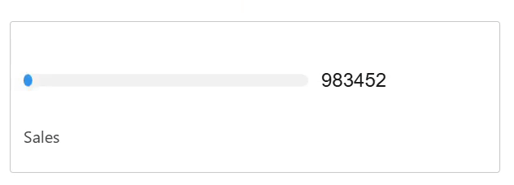

# Flat Bar Chart



## Aperçu

Le composant Lightning Web Component (LWC) 'Flat Bar Chart' offre un outil de visualisation clair et efficace pour afficher des données comparatives dans Salesforce. Ce composant est conçu pour représenter les données sous forme de graphique à barres horizontales, permettant aux utilisateurs de comparer facilement différentes catégories ou métriques côte à côte. En utilisant le Flat Bar Chart, les utilisateurs peuvent rapidement évaluer les performances, identifier les tendances et prendre des décisions basées sur les données.

## Comment ça Marche ?

Le Flat Bar Chart affiche les données sous forme de graphique à barres horizontales, avec des segments représentant différentes métriques. Le graphique comprend :
- **Valeur Actuelle** : La valeur actuelle de la métrique.
- **Valeur Cible** : La valeur cible ou seuil à laquelle la valeur actuelle est comparée.
- **Titre** (Optionnel) : Un titre spécifique pour le graphique, fournissant un contexte aux données affichées.
- **Format Pipe** (Optionnel) : Une fonction optionnelle pour personnaliser le format des valeurs affichées (par exemple, formatage en pourcentage).

## Utilisation

### Configuration du Flux

Pour utiliser le Flat Bar Chart, vous devez configurer un flux dans Salesforce qui récupère les données nécessaires et les transmet au LWC. Voici comment procéder :

1. **Définir la Variable `ResultCollection`** :
   - Dans le Flow Builder, créez une nouvelle variable nommée `ResultCollection`.
   - Définissez le Type de Données sur `Texte`.
   - Assurez-vous que "Autoriser plusieurs valeurs (collection)" est coché.
   - Marquez-la comme "Disponible pour la sortie" afin qu'elle puisse être accessible par le composant.

2. **Créer une Ressource de Formule** :
   - Créez une nouvelle ressource de type `Formule`.
   - Définissez le Nom API sur quelque chose comme `LaFormula`.
   - Définissez le Type de Données sur `Texte`.
   - Utilisez l'éditeur de formule pour construire votre chaîne JSON. Par exemple :
     ```plaintext
     '{"actualValue": "' + TEXT(5) + '", "targetValue": "' + TEXT(10) + '", "title": "Test"}'
     ```
   - Cette formule construit une chaîne JSON avec les valeurs spécifiées.

3. **Attribuer la Formule à `ResultCollection`** :
   - Ajoutez un élément `Affectation` à votre Flux.
   - Définissez la variable `ResultCollection` sur la valeur de la ressource de formule (`LaFormula`).
   - Assurez-vous que l'opérateur est défini sur `Ajouter`.

4. **Enregistrer et Activer le Flux** :
   - Enregistrez votre Flux.
   - Activez le Flux s'il n'est pas déjà actif.

### Utilisation des Requêtes d'Entrée

Alternativement, vous pouvez utiliser des requêtes d'entrée pour fournir des données au Flat Bar Chart. Voici comment :

1. **Définir les Requêtes d'Entrée** :
   - Créez une liste de requêtes d'entrée sous forme de chaîne JSON. Chaque requête doit inclure une clé (ID de référence) et une valeur (requête SOQL).
   - Exemple :
     ```json
     [
       {"referenceId": "wonOpportunities", "query": "SELECT SUM(Amount) totalAmount FROM Opportunity WHERE IsWon = true"}
     ]
     ```

2. **Passer les Requêtes d'Entrée au Composant** :
   - Utilisez l'attribut `inputQueries` du composant Flat Bar Chart pour passer la chaîne JSON des requêtes d'entrée.
   - Le composant exécutera cette requête et utilisera les résultats pour remplir le graphique.

3. **Créer une Fonction de Transformation** :
   - Définissez une fonction de transformation JavaScript dans un fichier et téléchargez-la en tant que Ressource Statique dans Salesforce. Cette fonction traitera les résultats des requêtes et les formatera pour le Flat Bar Chart.
   - Exemple :
     ```javascript
     /* Toutes les fonctions doivent être définies dans la portée window.MobeeDynamicFunctions pour fonctionner avec l'application mobile Mobee */

     window.MobeeDynamicFunctions = {
       calculateTotalWonAmount: (inputData) => {
         // Représente les données d'entrée récupérées par la référence définie
         let wonOpportunities = inputData['wonOpportunities'];
         if (wonOpportunities && wonOpportunities.length) {
           const totalAmount = wonOpportunities[0].totalAmount;
           let flatbarDataItem = {
             actualValue: totalAmount,
             targetValue: 1000000, // Valeur objective fixe pour la comparaison (par exemple, 1 000 000 $)
             title: "Montant Total Gagné",
             subtitle: "Par rapport à l'objectif de vente",
           };
           return [flatbarDataItem];
         }
         return [];
       }
     }
     ```

4. **Télécharger le Fichier JavaScript en tant que Ressource Statique** :
   - Dans Salesforce, allez dans **Setup**.
   - Dans la boîte de recherche rapide, tapez **Static Resources** et sélectionnez **Static Resources**.
   - Cliquez sur **New** pour télécharger votre fichier JavaScript contenant la fonction de transformation.
   - Fournissez un nom pour la Ressource Statique (par exemple, `MyMobeeFunctions`) et téléchargez le fichier.

5. **Définir la Fonction de Transformation** :
   - Dans les paramètres Mobee, définissez `Mobee Dynamic Function File Name` sur le nom de la Ressource Statique que vous avez créée (par exemple, `MyMobeeFunctions`).
   - Dans le champ intitulé **Nom de la Fonction de Transformation JavaScript**, entrez le nom de la fonction que vous avez définie (par exemple, `calculateTotalWonAmount`).