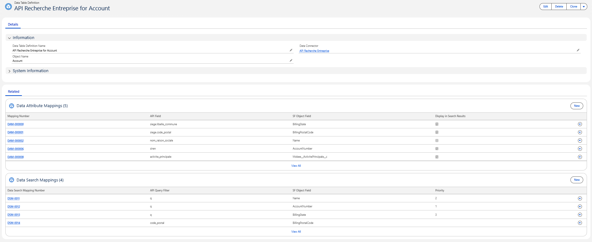
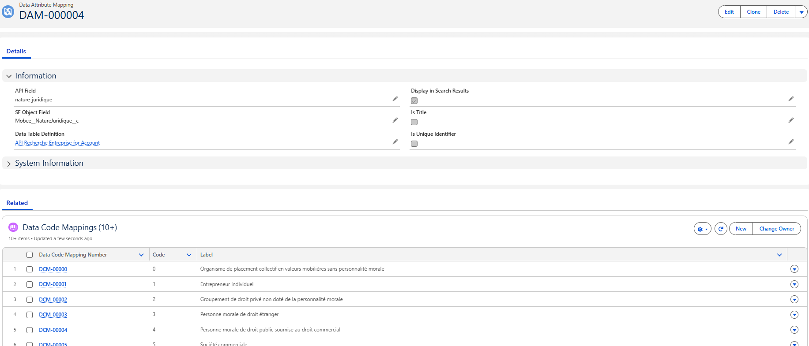
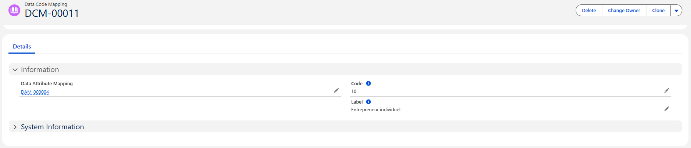

# Objets Salesforce (Paramètres de données)

Pour configurer et personnaliser votre Data Connector, nous utilisons quatre objets. Ceux-ci vous permettent de définir le comportement de votre connecteur, les données qu'il récupère et comment elles sont mappées à vos enregistrements Salesforce.

 

---

## 1. Data Connector

Cet enregistrement représente une API externe à laquelle vous souhaitez vous connecter.

| Libellé du champ | Nom API | Type | Description |
|-----------------|--------------|----------|-----------------|
| **Connector Name** | `Name` | Texte | Un nom convivial pour le Data Connector |
| **Connector Type** | `Mobee__ConnectorType__c` | Liste de sélection | Spécifie le type de connecteur parmi la liste disponible (Exemple : "API Recherche Entreprise", "iRaiser Connector") |

📌 Chaque Data Connector peut contenir une ou plusieurs "Data Table Definitions".

---

## 2. Data Table Definition

Cet enregistrement lie le connecteur à un objet Salesforce spécifique (comme Comptes, Contacts, etc.) et définit comment afficher et interagir avec les données.

| Libellé du champ | Nom API | Type | Description |
|-----------------|--------------|----------|-----------------|
| **Data Table Definition Name** | `Name` | Texte | Un libellé convivial pour cette configuration de table de données |
| **Data Connector** | `Mobee__DataConnector__c` | Lookup | Référence la configuration du Data Connector parent auquel cette table appartient |
| **Object Name** | `Mobee__ObjectName__c` | Texte | Nom API de l'objet Salesforce que ces données rempliront (Exemple : `Account`, `Contact`) |
| **Object Record Type** | `Mobee__ObjectRecordType__c` | Texte | Spécifie le(s) type(s) d'enregistrement à utiliser lors du traitement des enregistrements (optionnel) |
| **Parent Table Definition** | `Mobee__ParentTableDefinition__c` | Lookup (Data Table Definition) | Lie cette table à une autre Data Table Definition pour une synchronisation hiérarchique parent-enfant (Exemple : Contact sous Account) (optionnel) |
| **Parent Table Field API Name** | `Mobee__ParentTableFieldAPIName__c` | Texte | Nom API du champ de recherche utilisé pour relier les enregistrements au parent (Exemple : `AccountId`) (optionnel) |

📌 Chaque Data Table Definition peut inclure plusieurs mappages d'attributs et de recherche.

---

## 3. Data Attribute Mapping

Ces enregistrements mappent les champs de l'API externe aux champs Salesforce, définissent ce qui est affiché dans les résultats de recherche et permettent le pré-remplissage des valeurs lors de la création de nouveaux enregistrements Salesforce.

| Libellé du champ | Nom API | Type | Description |
|-----------------|--------------|----------|-----------------|
| **Data Table Definition** | `Mobee__DataTableDefinition__c` | Lookup | La table associée à laquelle ce mappage appartient |
| **SF Object Field** | `Mobee__SFObjectField__c` | Texte | Le nom API du champ Salesforce auquel mapper la valeur entrante |
| **API Field** | `Mobee__APIField__c` | Texte | Le nom du champ du système externe mappé |
| **Display in Search Results** | `Mobee__DisplayInSearchResults__c` | Case à cocher | Lorsque cochée, ce champ apparaît dans la liste des résultats dans l'interface |
| **Is Title** | `Mobee__IsTitle__c` | Case à cocher | Lorsque cochée, ce champ est utilisé comme titre principal dans les résultats de recherche |
| **Is Unique Identifier** | `Mobee__IsUniqueIdentifier__c` | Case à cocher | Indique que ce champ identifie de manière unique l'enregistrement pour la logique de correspondance/upsert |

📌 Utilisez ceci pour contrôler les résultats que les utilisateurs voient et quelles valeurs sont transmises à Salesforce.

---

## 4. Data Search Mapping

Ces enregistrements définissent les paramètres que les utilisateurs peuvent appliquer pour filtrer les données dans Salesforce et l'API lors d'une recherche. Chaque paramètre correspond à un champ Salesforce et est lié à un paramètre de requête API spécifique.

| Libellé du champ | Nom API | Type | Description |
|-----------------|--------------|----------|-----------------|
| **Data Table Definition** | `Mobee__DataTableDefinition__c` | Lookup | La table associée à laquelle ce paramètre de recherche appartient |
| **SF Object Field** | `Mobee__SFObjectField__c` | Texte | Le champ Salesforce affiché dans la barre de filtres |
| **API Query Filter** | `Mobee__APIQueryFilter__c` | Texte | Le paramètre de requête envoyé à l'API externe |
| **Priority** | `Mobee__Priority__c` | Nombre | Détermine l'ordre d'essai des filtres si plusieurs champs SF sont mappés au même paramètre API |

📌 Utilisez ceci pour définir les options de filtrage qui apparaissent en haut de l'écran de recherche.

---

## 5. Data Code Mapping

Les enregistrements **Data Code Mapping** établissent la couche de traduction entre les codes bruts retournés par l'API externe et les valeurs standardisées affichées aux utilisateurs. Chaque mappage est lié à un **Data Attribute Mapping** (la définition du champ) et ensemble ils forment un dictionnaire de Code → Libellé. Cela garantit que les utilisateurs voient des libellés clairs et lisibles au lieu de codes techniques, tout en maintenant la cohérence interne pour les champs tels que les classifications, les statuts ou d'autres données codées.

| Libellé du champ | Nom API | Type | Description |
|-----------------|--------------|----------|-----------------|
| **Data Attribute Mapping** | `Mobee__DataAttributeMapping__c` | Lookup | L'attribut auquel ce mappage de code appartient (clé de regroupement) |
| **Code** | `Mobee__Code__c` | Texte | Le code brut reçu de l'API externe |
| **Label** | `Mobee__Label__c` | Texte | La valeur conviviale affichée dans Salesforce |

📌 Utilisez cet objet pour traduire les codes de l'API externe en libellés lisibles et maintenir des valeurs cohérentes dans l'interface et la logique du Data Connector.

---
