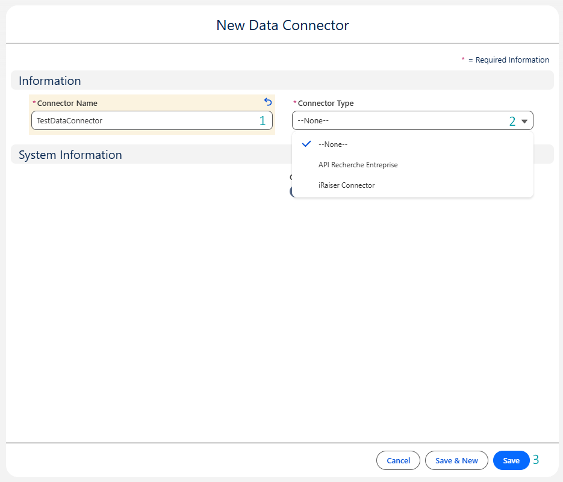

# Configuration du Data Connector

## Vue d'ensemble

Ce guide couvre la configuration des Data Connectors dans Salesforce. Il y a deux niveaux de configuration :

1. [**Configuration générale**](3-data-connector-module-configuration.md#configuration-générale-1) – S'applique à tous les data connectors

2. [**Configuration spécifique au connecteur**](3-data-connector-module-configuration.md#configuration-spécifique-au-connecteur) – S'applique aux connecteurs individuels comme `Recherche Entreprise`, `iRaiser Connector`, etc.

---

## Configuration générale

Ces étapes doivent être complétées pour chaque data connector :

1. **Attribuer les Permission Sets** – Donner l'accès aux utilisateurs.
2. **Créer un Data Connector** – Définir le connecteur et son type.

---

## Accès et permissions

Pour garantir le bon fonctionnement et la sécurité du module, les utilisateurs doivent avoir accès aux composants clés :

### Permission Set : `Mobee Data Connector`

Attribuez ce permission set à tous les utilisateurs qui utiliseront le Data Connector. Il inclut :

- L'accès aux classes Apex utilisées par le connecteur
- L'accès aux Lightning Web Components (LWC)
- L'accès aux external credentials utilisées par les named credentials qui en dépendent
- Les permissions sur les objets et champs (lecture/création sur les objets du connecteur)

> ❗ Sans ce permission set, les utilisateurs rencontreront des erreurs d'autorisation lorsqu'ils tenteront d'utiliser le connecteur.

#### Étapes pour attribuer le Permission Set

1. **Accédez à Setup → Users**
   
 

2. **Accédez à l'utilisateur souhaité**
   
 

3. **Dans la page de détail de l'utilisateur, faites défiler jusqu'à Permission Set Assignments → Cliquez sur "Edit Assignments"**
   
 

4. **Sélectionnez `Mobee Data Connector` dans la liste à gauche → Cliquez sur "Add" → Enregistrez**
   
 

5. **Vérifiez que le permission set est maintenant listé dans les attributions de l'utilisateur**
   
 

---

## Créer un [Data Connector](2-data-connector-module-custom-objects.md#1-data-connector)

1. **Ouvrez l'onglet Data Connector**
   - Dans le Salesforce App Launcher, recherchez **Data Connectors**.

   

2. **Créez un nouveau Data Connector**
   - Cliquez sur **New**.

   

3. **Remplissez les détails du connecteur**
   - Saisissez un **Connector Name**
   - Sélectionnez le **Connector Type** approprié

   

📌 Après l'enregistrement, votre connecteur est prêt à être lié aux définitions de tables et aux mappages.

---

## Configuration spécifique au connecteur

Une fois les étapes ci-dessus terminées, continuez avec le guide de configuration de votre connecteur spécifique :

| Data Connector | Documentation |
|----------------|--------------|
| **Recherche Entreprise** | [Voir le guide](./5-dcm-recherche-entreprise-configuration.md) |
| **iRaiser** | *(Bientôt disponible)* |

📌 Chaque connecteur peut nécessiter des étapes de configuration supplémentaires en fonction de sa structure API et de son cas d'usage métier.

---
