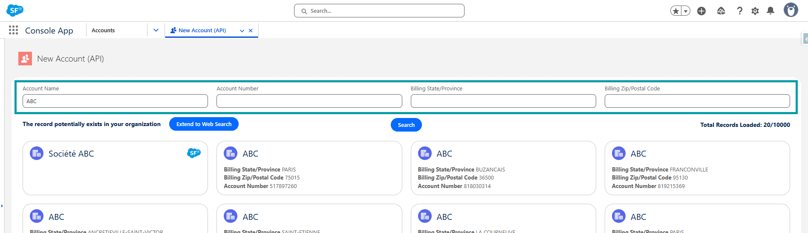
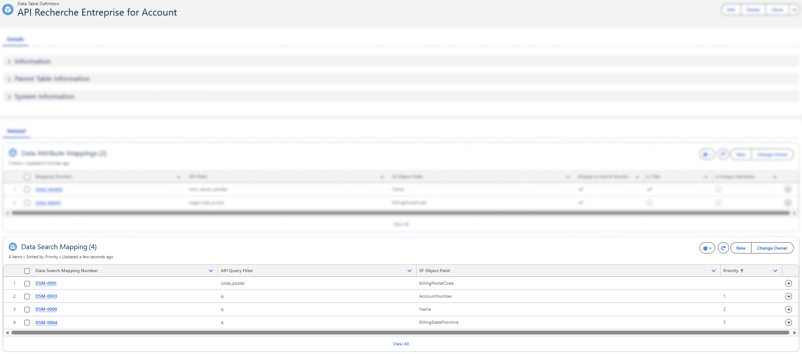
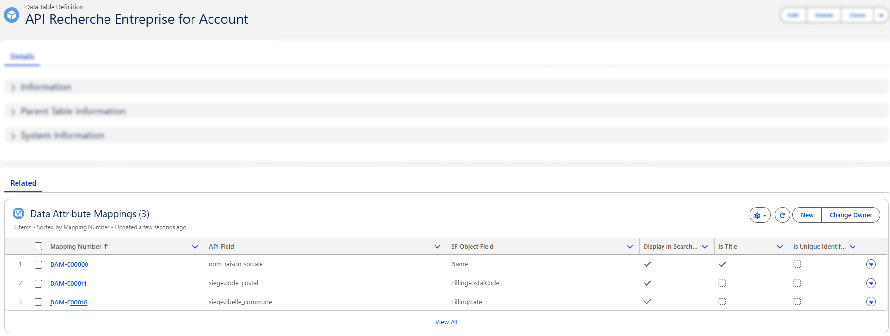

# Configuration de Recherche Entreprise

## Vue d'ensemble

> ⚠️ **Prérequis :** Avant de configurer ce connecteur, assurez-vous que la **Configuration générale** est terminée.
> Voir [Configuration générale](3-data-connector-module-configuration.md) pour les étapes d'attribution des permission sets et de création d'un Data Connector.

1. [**Créer la Data Table Definition**](5-dcm-recherche-entreprise-configuration.md#data-table-definition) – Lier le connecteur à un objet Salesforce.
2. [**Configurer les filtres et entrées de recherche**](5-dcm-recherche-entreprise-configuration.md#filtres--entrées-de-recherche) – Définir les filtres pour la recherche de données externes en créant des Data Search Mappings.
3. [**Configurer l'affichage des résultats**](5-dcm-recherche-entreprise-configuration.md#affichage-des-résultats-de-recherche) – Définir comment les données de réponse sont mappées aux champs Salesforce en créant des Data Attribute Mappings.
4. [**Configurer les mappages de codes (si nécessaire)**](5-dcm-recherche-entreprise-configuration.md#data-code-mapping) – Traduire les codes bruts de l'API en libellés lisibles afin que les utilisateurs voient des valeurs significatives au lieu de codes, en créant des Data Code Mappings.
5. [**Ajouter le Lightning Web Component**](5-dcm-recherche-entreprise-configuration.md#lightning-web-component--data-connector) – Intégrer l'interface là où les utilisateurs en ont besoin.

Dans la section suivante, nous examinerons de plus près chacune de ces étapes de configuration et comment les différents composants fonctionnent ensemble pour alimenter le data connector `Recherche Entreprise`.

---

## Data Table Definition

Comme décrit dans la section [Data Table Definition](2-data-connector-module-custom-objects.md#2-data-table-definition), cette configuration lie un Data Connector à un objet Salesforce.

##### Exemple


### Créer la Data Table Definition

La Data Table Definition détermine quel objet Salesforce le connecteur va rechercher et enrichir.
Pour le connecteur **Recherche Entreprise**, nous allons le configurer sur l'objet **Account** — cependant, gardez à l'esprit que le connecteur est conçu pour prendre en charge d'autres objets si nécessaire.

#### Champs requis à remplir

| Champ | Signification | Valeur à définir |
|-------|--------|--------------------------|
| **Data Connector** | Lie cette définition de table au connecteur que vous avez créé précédemment | Sélectionnez votre connecteur *Recherche Entreprise* |
| **Object Name** | L'objet Salesforce où l'API créera ou mettra à jour les enregistrements | Saisissez le nom API de l'objet. *Exemple :* `Account` ou `Company__c` |
| **Object Record Type** *(optionnel)* | Limite les appels API externes aux types d'enregistrement spécifiés. Les autres types d'enregistrement peuvent toujours ouvrir le composant mais ne rechercheront que dans Salesforce (pas d'appel API). | Seulement si votre objet a des types d'enregistrement. **Developer Names** séparés par des virgules. |

> 💡 Si votre org n'utilise **pas** de types d'enregistrement sur l'objet désigné, laissez **Object Record Type** vide.
> 🛑 Lors du remplissage de **Object Record Type**, saisissez le **Developer Name**, pas le libellé.
> Exemple : `Business_Account, NGO_Account`

#### Exemple de configuration

| Champ | Valeur d'exemple |
|-------|---------------|
| Data Connector | *Recherche Entreprise* |
| Object Name | `Account` |
| Object Record Type | `Business_Account, PersonAccount` |

#### Étapes

1. Accédez à **Data Table Definitions**
2. Cliquez sur **New**
3. Remplissez les champs comme décrit ci-dessus
4. Enregistrez l'enregistrement


---

## Filtres et entrées de recherche

### Aperçu

La barre de filtres affichée en haut du composant est générée à partir des enregistrements **Data Search Mapping**.



Chaque filtre est lié à un champ Salesforce et à un paramètre de requête API, offrant aux utilisateurs un moyen dynamique et guidé de rechercher.

### Comment configurer les filtres (Guide technique 🛠️)

Chaque filtre est défini dans un enregistrement **Data Search Mapping** et nécessite deux valeurs clés :

| Champ | Signification | Valeur à définir |
|----------|-------------|------------------|
| **Data Table Definition** | Lie ce filtre de recherche à la définition de table de données correspondante | Sélectionnez l'enregistrement *Data Table Definition* associé |
| **SF Object Field** | Champ Salesforce dont la valeur sera utilisée comme entrée de recherche | Developer Name du champ (Exemple : `Name`, `AccountNumber`) |
| **API Query Filter** | Paramètre de requête que l'API externe attend pour la recherche | Nom du paramètre API (Exemple : `q`, `code_postal`) |
| **Priority** | Détermine l'ordre dans lequel les mappages de recherche multiples pour le même paramètre de requête API sont évalués. Les nombres les plus bas sont essayés en premier, garantissant que le mappage le plus important ou spécifique est appliqué avant les autres. Cette priorité n'affecte que les mappages partageant le même paramètre ; tous les autres paramètres sont toujours inclus dans la requête. | `1`, `2`, `3`, etc. |

> 💡 **Cas d'usage de la priorité :**
> Si deux mappages partagent le même paramètre de requête (Exemple : `q`), l'un mappé au **Numéro de compte** (priorité 1) et l'autre au **Nom du compte** (priorité 2), le connecteur tentera d'abord la recherche avec le Numéro de compte. Si aucun résultat n'est trouvé, il réessaiera automatiquement avec le Nom du compte.

#### 1. Définir le SF Object Field dans le Data Search Mapping

- C'est le nom API interne du champ Salesforce que vous souhaitez que l'utilisateur remplisse.
- Il doit exister sur l'objet associé à votre Data Table Definition.
- Vous pouvez le trouver dans **Object Manager → [Votre Objet] → Fields & Relationships**.

📌 <u>*Exemple :*</u>

Pour permettre aux utilisateurs de rechercher des comptes à l'aide de leur `Nom de compte`, définissez le **SF Object Field** sur `Name` :


#### 2. Définir l'API Query Filter dans le Data Search Mapping

- Cette valeur provient de la **documentation de l'API externe**.
- Elle vous indique quels paramètres de chaîne de requête l'API prend en charge pour le filtrage.
- Ces paramètres ne se trouvent **pas dans la réponse**, mais plutôt dans la **requête** — généralement documentés sous "search", "filter" ou "GET parameters".

📌 <u>*Exemple :*</u>

Si l'API permet une recherche générale via un paramètre `q`, et que vous souhaitez permettre aux utilisateurs de rechercher par Nom de compte, définissez l'**API Query Filter** sur `q`


> La requête finale ressemblera à :
> `https://external-api.com/search?q=ABC`

#### 3. Exemple d'enregistrements Data Search Mapping



---

## Affichage des résultats de recherche

### Aperçu

Les colonnes affichées dans la liste des résultats de recherche sont définies via les enregistrements **Data Attribute Mapping**.


> 💡 Seuls les champs avec **Display in Search Results** coché apparaîtront ici. Lorsqu'un utilisateur sélectionne un résultat, les champs mappés sont utilisés pour remplir l'enregistrement Salesforce.

### Comment configurer les attributs de résultat (Guide technique 🛠️)

Chaque attribut de résultat est défini dans un enregistrement **Data Attribute Mapping** avec les champs clés :

| Champ | Signification | Valeur à définir |
|-------|--------|-------------|
| **Data Table Definition** | Lie ce mappage à la définition de table de données correspondante | Sélectionnez l'enregistrement *Data Table Definition* associé |
| **SF Object Field** | Champ Salesforce où la valeur doit être stockée | Developer Name du champ (Exemple : `Name`, `AccountNumber`) |
| **API Field** | Chemin du champ depuis la réponse de l'API externe | Chemin du champ JSON de l'API (Exemple : `siren`, `siege.code_postal`) |
| **Display in Search Results** | Indique si ce champ doit être visible dans les listes de résultats de recherche | Coché ou décoché |
| **Is Title** | Marque ce champ comme titre principal dans les résultats de recherche | Coché ou décoché |

#### 1. Définir le SF Object Field dans le Data Attribute Mapping

- C'est le nom API interne du champ Salesforce que vous souhaitez que l'utilisateur remplisse.
- Il doit exister sur l'objet associé à votre Data Table Definition.
- Vous pouvez le trouver dans **Object Manager → [Votre Objet] → Fields & Relationships**.

📌 <u>*Exemple :*</u>

Pour mapper le champ `Numéro de compte`, définissez le **SF Object Field** sur `AccountNumber` :


#### 2. Définir l'API Field dans le Data Attribute Mapping

C'est le nom exact du champ (ou chemin) tel que retourné par l'API externe.

- Utilisez la **notation par points** pour accéder aux objets imbriqués.
- Assurez-vous que le champ existe dans l'objet du tableau `results`.

📌 <u>*Exemple :*</u>

<details>
<summary>Voir la réponse JSON de l'API</summary>

```json
Exemple de réponse API :

{
  "results": [
    {
      "siren": "123456789",
      "nom_complet": "Dummy Company",
      "nom_raison_sociale": "DUMMY COMPANY SARL",
      "sigle": null,
      "nombre_etablissements": 10,
      "nombre_etablissements_ouverts": 8,
      "siege": {
        "activite_principale": "00.00X",
        "activite_principale_registre_metier": null,
        "annee_tranche_effectif_salarie": "2023",
        "adresse": "1 RUE EXEMPLE 75001 PARIS",
        "caractere_employeur": "O",
        "cedex": null,
        "code_pays_etranger": null,
        "code_postal": "75001",
        "commune": "75001",
        "complement_adresse": "DIRECTION GENERALE",
        "date_creation": "2020-01-01",
        "date_fermeture": null,
        "date_debut_activite": "2020-02-01",
        "date_mise_a_jour": "2025-01-01T00:00:00",
        "departement": "75",
        "distribution_speciale": null,
        "est_siege": true,
        "etat_administratif": "A",
        "geo_id": "75001_0001",
        "indice_repetition": null,
        "latitude": "48.8566",
        "libelle_cedex": null,
        "libelle_commune": "PARIS 1",
        "libelle_commune_etranger": null,
        "libelle_pays_etranger": null,
        "libelle_voie": "RUE EXEMPLE",
        "liste_enseignes": ["DUMMY COMPANY"],
        "liste_finess": ["000000001"],
        "liste_idcc": ["0001"],
        "liste_id_bio": ["0001"],
        "liste_rge": ["RGE001"],
        "liste_uai": ["UAI001"],
        "longitude": "2.3522",
        "nom_commercial": null,
        "numero_voie": "1",
        "region": "11",
        "epci": "000000001",
        "siret": "12345678900001",
        "statut_diffusion_etablissement": "O",
        "tranche_effectif_salarie": "5",
        "type_voie": "RUE"
      },
      "date_creation": "2020-01-01",
      "date_fermeture": null,
      "tranche_effectif_salarie": "5",
      "annee_tranche_effectif_salarie": "2023",
      "date_mise_a_jour": "2025-01-01",
      "categorie_entreprise": "SME",
      "caractere_employeur": "O",
      "annee_categorie_entreprise": "2023",
      "etat_administratif": "A",
      "nature_juridique": "1234",
      "activite_principale": "00.00X",
      "section_activite_principale": "A",
      "statut_diffusion": "O",
      "matching_etablissements": [
        {
          "activite_principale": "00.00X",
          "adresse": "2 RUE TEST 75001 PARIS",
          "annee_tranche_effectif_salarie": "2023",
          "ancien_siege": false,
          "caractere_employeur": "O",
          "code_postal": "75001",
          "commune": "75001",
          "date_creation": "2020-02-01",
          "date_debut_activite": "2020-02-01",
          "date_fermeture": null,
          "epci": "000000001",
          "est_siege": false,
          "etat_administratif": "A",
          "geo_id": "75001_0002",
          "latitude": "48.8566",
          "libelle_commune": "PARIS 1",
          "liste_enseignes": ["DUMMY COMPANY"],
          "liste_finess": ["000000002"],
          "liste_idcc": ["0002"],
          "liste_id_organisme_formation": ["OF001"],
          "liste_id_bio": ["0002"],
          "liste_rge": ["RGE002"],
          "liste_uai": ["UAI002"],
          "longitude": "2.3522",
          "nom_commercial": null,
          "region": "11",
          "siret": "12345678900002",
          "statut_diffusion_etablissement": "O",
          "tranche_effectif_salarie": "3"
        }
      ],
      "dirigeants": [
        {
          "nom": "Doe",
          "prenoms": "Jane",
          "annee_de_naissance": "1980",
          "date_de_naissance": "1980-06",
          "qualite": "Directeur général",
          "nationalite": "Française",
          "type_dirigeant": "personne physique"
        }
      ],
      "finances": {
        "2023": {
          "ca": 1000000,
          "resultat_net": 100000
        }
      },
      "complements": {
        "collectivite_territoriale": {
          "code_insee": "01",
          "code": "01",
          "niveau": "département",
          "elus": [
            {
              "nom": "Smith",
              "prenoms": "Alice",
              "annee_de_naissance": "1975",
              "fonction": "Maire",
              "sexe": "F"
            }
          ]
        },
        "convention_collective_renseignee": true,
        "liste_idcc": ["0001"],
        "egapro_renseignee": true,
        "est_achats_responsables": true,
        "est_alim_confiance": true,
        "est_association": false,
        "est_bio": true,
        "est_entrepreneur_individuel": false,
        "est_entrepreneur_spectacle": false,
        "est_ess": false,
        "est_finess": false,
        "est_organisme_formation": true,
        "est_patrimoine_vivant": true,
        "est_qualiopi": true,
        "liste_id_organisme_formation": ["OF001"],
        "est_rge": false,
        "est_siae": false,
        "est_service_public": false,
        "est_l100_3": false,
        "est_societe_mission": false,
        "est_uai": false,
        "bilan_ges_renseigne": false,
        "identifiant_association": null,
        "statut_bio": true,
        "statut_entrepreneur_spectacle": "string",
        "type_siae": "string"
      }
    }
  ],
  "total_results": 0,
  "page": 1,
  "per_page": 10,
  "total_pages": 1000
}
```

</details>

| SF Object Field | API Field |
|-----------|-------------------|
| AccountNumber | `siren` |
| Name | `nom_raison_sociale` |
| BillingPostalCode | `siege.code_postal` |
| MainActivityCode__c | `siege.activite_principale` |

##### Comprendre la différence entre `nom_complet` et `nom_raison_sociale`

Lors du mappage du nom d'une entreprise ou d'un établissement, l'API Recherche Entreprise fournit deux champs différents. Le choix du bon champ dépend du type d'entité concernée.

**`nom_complet`**
- Le nom d'affichage par défaut retourné par l'API.
- Toujours renseigné pour les **entités individuelles** (entrepreneurs individuels) et les **entités juridiques** (sociétés).

**`nom_raison_sociale`**
- Le nom juridique officiel de l'entreprise (également appelé *raison sociale* ou *dénomination sociale*).
- Renseigné uniquement pour les **entités juridiques** (SAS, SARL, SA, associations, etc.).

Dans la plupart des cas, `nom_complet` est le champ le plus sûr à mapper lorsque vous souhaitez un comportement cohérent pour tous les types d'entités. Utilisez `nom_raison_sociale` uniquement si vous avez spécifiquement besoin du nom juridique de l'entreprise dans un contexte réservé aux sociétés.

#### 3. Exemple d'enregistrements Data Attribute Mapping



---

## Data Code Mapping

### Objectif

Les enregistrements Data Code Mapping définissent la couche de traduction entre les codes bruts retournés par l'API **Recherche Entreprise** (comme la *Nature Juridique*, ou l'*Activité Principale*) et leurs libellés. Cela garantit que les utilisateurs voient des valeurs significatives au lieu de codes cryptiques.

### Aperçu

Les résultats de recherche affichent des libellés lisibles pour le champ `Nature Juridique` au lieu des codes bruts retournés par l'API.


### Comment configurer le Data Code Mapping (Guide technique 🛠️)

Chaque enregistrement **Data Code Mapping** est connecté via un lookup à un enregistrement **Data Attribute Mapping**. Lorsque plusieurs enregistrements **Data Code Mapping** sont liés au même **Data Attribute Mapping**, ils créent collectivement un dictionnaire de **Code → Libellé** qui est utilisé pour afficher des valeurs significatives aux utilisateurs et remplir les champs Salesforce avec les libellés.

Chaque enregistrement **Data Code Mapping** inclut les champs clés suivants :

| Champ | Signification | Valeur à définir |
|-------|---------|--------------|
| **Data Attribute Mapping** | Lie ce mappage de code au champ Salesforce où le libellé sera utilisé | Sélectionnez l'enregistrement *Data Attribute Mapping* associé |
| **Code** | Le code exact reçu de l'API Recherche Entreprise | Exemple : `A`, `I`, `4711D`, `GE` |
| **Label** | Signification lisible du code | Exemple : `Actif`, `Inactif`, `Société commerciale`, `Entrepreneur individuel` |

#### 1. Identifier le code dans la réponse API

L'API Recherche Entreprise contient plusieurs champs codés tels que :

- `activite_principale`
- `etat_administratif`
- `nature_juridique`
- `tranche_effectif_salarie`
- `categorie_entreprise`

**Exemple d'extrait de réponse API :**

```json
{
  "activite_principale": "4711D",
  "etat_administratif": "A",
  "nature_juridique": "5499",
  "tranche_effectif_salarie": "3",
  "categorie_entreprise": "SME"
}
```

#### 2. Créer les enregistrements Data Code Mapping correspondants

##### <u>Source</u>

L'API **Recherche Entreprise** fournit des nomenclatures officielles pour nombre de ses champs codés, comme la *Nature Juridique* ou l'*Activité Principale – NAF*. Ces nomenclatures sont publiées par l'**INSEE** et disponibles au format Excel, contenant les tables complètes de paires **Code → Libellé** :

🌐 https://www.insee.fr/fr/information/2016811

Vous pouvez utiliser ces fichiers officiels pour remplir vos enregistrements Data Code Mapping. Cela garantit que :

- Tous les codes possibles sont couverts
- Les libellés sont précis et standardisés
- Les utilisateurs voient toujours la terminologie correcte définie par l'INSEE

> 💡 L'utilisation des nomenclatures officielles est fortement recommandée lors de la configuration des mappages pour des champs comme `nature_juridique`, `activite_principale`, ou tout autre attribut codé retourné par l'API Recherche Entreprise.

##### <u>Méthode d'import</u>

La méthode la plus efficace est de préparer vos mappages dans un tableur au format CSV et de les importer dans Salesforce à l'aide de l'un des outils d'import en masse disponibles.

Voici le processus recommandé :

1. **Téléchargez le fichier Excel de nomenclature INSEE** pour le champ codé que vous souhaitez configurer.
<br/>

2. **Ouvrez le fichier Excel** et manipulez-le pour le préparer à l'import :
   - Nettoyez les lignes qui ne constituent pas une paire **Code → Libellé**
   - Ajoutez une nouvelle colonne qui représente le **Data Attribute Mapping**
   - Remplissez cette colonne avec le **Name** (ou Id) du **Data Attribute Mapping** auquel ces codes appartiennent.
  **N.B :** Les titres de colonnes ne sont pas importants car ils seront mappés avec les champs Salesforce lors de l'import.
<br/>

3. **Enregistrez le fichier au format CSV**
<br/>

4. **Ouvrez le Salesforce Data Import Wizard** et sélectionnez votre objet **Data Code Mapping**.
<br/>

5. **Importez votre CSV**, et lors du mappage des champs :
   - Mappez la colonne INSEE *Code* → `Code__c`
   - Mappez la colonne INSEE *Libellé* → `Label__c`
   - Mappez votre nouvelle colonne → `DataAttributeMapping__c`
<br/>

6. **Lancez l'import** et vérifiez les enregistrements dans Salesforce.

#### 3. Exemple d'enregistrements Data Code Mapping


---

## Lightning Web Component : `Data Connector`

- Interface personnalisée où les utilisateurs :
  - Saisissent des termes de recherche (à l'aide des filtres mappés)
  - Visualisent les données externes (basées sur les attributs mappés)
  - Sélectionnent et importent des enregistrements dans Salesforce

> 💡 Ce composant est piloté par la configuration — il utilise les données et les mappages définis dans le **Data Connector**, la **Data Table Definition**, les **Data Attribute Mappings** et les **Data Search Mappings** pour fonctionner.

### Ajouter le composant en tant que bouton de vue de liste

Le Data Connector peut être lancé directement depuis un bouton de vue de liste, offrant aux utilisateurs un accès rapide au composant sans naviguer dans d'autres menus.

Dans ce guide, nous allons illustrer comment activer le Data Connector pour n'importe quel objet en créant la Lightning Page, l'onglet Lightning et le bouton de vue de liste requis.

#### 1. Création de la Lightning Page

1. Accédez à **Setup** → **Lightning App Builder** et cliquez sur **New**
   

2. Choisissez **App Page** comme type
   

3. Créez et configurez la page

4. Ajoutez le composant **Data Connector** à la page et configurez ses paramètres, puis enregistrez et activez
   

#### 2. Créer / Vérifier l'onglet Lightning

1. Depuis **Setup**, recherchez **Tabs**
2. Faites défiler jusqu'à **Lightning Page Tabs**
3. Vérifiez si un onglet est déjà créé pour votre Lightning Page *(3a)*
4. Sinon, créez un nouvel onglet et liez-le à la page *(3b)*
   

#### 3. Créer un bouton de vue de liste

1. Accédez à **Object Manager** et ouvrez l'objet où vous souhaitez exposer le Data Connector (Exemple : **Account**, **Contact**)
   

2. Accédez à **Buttons, Links, and Actions** → **New Button or Link**
   

3. Choisissez **List Button** comme type d'affichage

4. Dans l'URL, référencez l'onglet Lightning que vous avez créé
   _Exemple :_ `/lightning/n/Mobee__TestingNewLightningPage`

   > **Note :** Cocher **Display Checkboxes (for Multi-Record Selection)** peut causer des problèmes dans une **Console App**. Laissez cette option décochée sauf si la sélection multi-enregistrements est spécifiquement requise en dehors d'un contexte Console App.

   

5. Enregistrez le bouton

#### 4. Ajouter le bouton à la vue de liste

1. Modifiez la **disposition des boutons de vue de liste** (List View Button Layout).


2. Dans la liste **Available Buttons**, localisez **New** et déplacez-le vers la section **Selected Buttons**.


3. Le bouton **New** apparaîtra désormais dans la vue de liste des comptes, lançant la page de création de compte alimentée par le **Data Connector**.

Maintenant, lorsque les utilisateurs ouvrent la vue de liste de cet objet, ils verront votre bouton personnalisé. En cliquant dessus, le Data Connector s'ouvrira dans la Lightning Page que vous avez assignée.

👉 En suivant cette approche, vous pouvez reproduire l'exemple **Account** pour tout autre objet nécessitant le Data Connector. La configuration Account sert de modèle, mais vous êtes libre de l'étendre à travers votre org.

---
