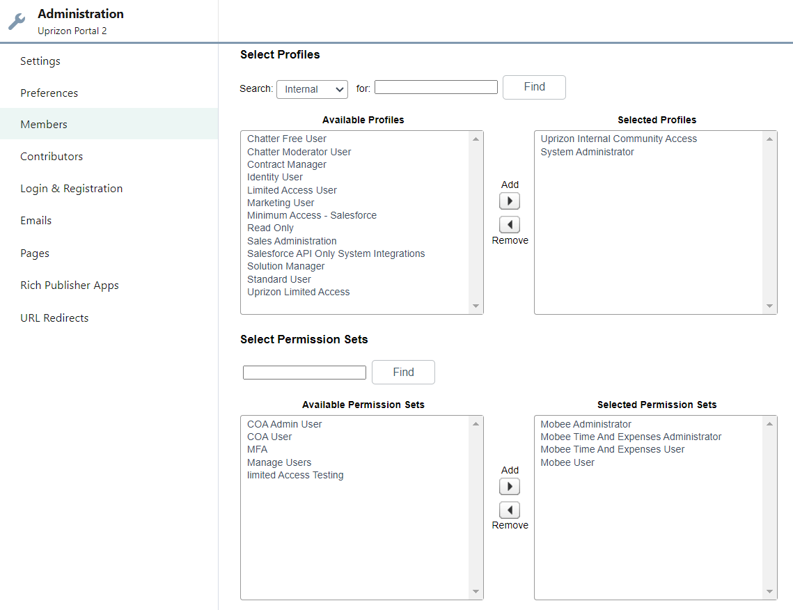
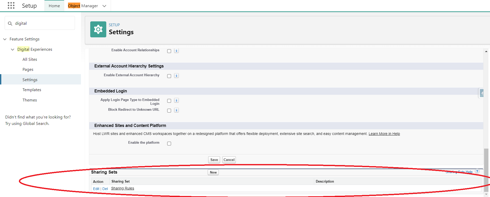
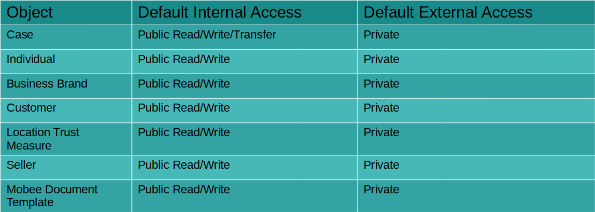

## Part 1: Object Level Security
### Location

Setup > Quick Find > Feature Settings > Digital Experiences > All Sites > Uprizon Portal 2 Builder >  Menu > Administration > Members

### Object Permissions Per Profile
1. Uprizon Internal Community Access

    | Object      | Access             |
    |-------------|--------------------|
    | Cases       | Read, Create, Edit |
    | Documents   | Read               |
    | Solutions	  | Read               |
2. System Administrator

    \*ALL OBJECTS\*

### Object Access Per Permission Set
1. Mobee Administrator

    | Object                          | Access                                           |
    |---------------------------------|--------------------------------------------------|
    | Customers                       | Read, View All                                   |
    | Customer Order Product History  | Read, Create, Edit, Delete, View All, Modify All |
    | Partner Contract Terms          | Read, View All                                   |
    | Partner Pricebook Entries	      | Read, View All                                   |
    | Partner Product Catalog	      | Read, View All                                   |
    | Service Order Detail	          | Read, Create, Edit, Delete, View All, Modify All |
    | Service Orders                  | Read, Create, Edit, Delete, View All, Modify All |
2. Mobee Time And Expenses Administrator

    | Object                          | Access                                           |
    |---------------------------------|--------------------------------------------------|
    |Assignments                      | Read, Create, Edit                               |
    |Projects                         | Read, Create, Edit                               |
    |Time Entries                     | Read, Create, Edit, Delete                       |
3. Mobee Time And Expenses User

    | Object                          | Access                                           |
    |---------------------------------|--------------------------------------------------|
    |Assignments                      | Read                                             |
    |Projects                         | Read                                             |
    |Time Entries                     | Read, Create, Edit, Delete                       |
4. Mobee User

    | Object                          | Access                                           |
    |---------------------------------|--------------------------------------------------|
    |Mobee Custom Sort Data	          | Read, Create, Edit, Delete                       |
    |Mobee Documents Templates	      | Read, Create, Edit, Delete                       |
    |Mobee Sync Logs	              | Read, Create, Edit, Delete                       |

## Part 2: Record Level Security
### Location
Setup > Quick Find > Feature Settings > Digital Experiences > Settings > Sharing Sets

### Sharing Rules
External Organization Wide Defaults that affect only community users are enabled, and differ from the Internal Organization Wide Defaults on the following objects:

### Sharing Sets
A single sharing set exists: “Sharing Rules” and it grants Read/Write access to Assignment (which has private access on both internal and external OWDs) records if 
“User:Contact = Assignment:Mobee__Assignee__c.Contact”