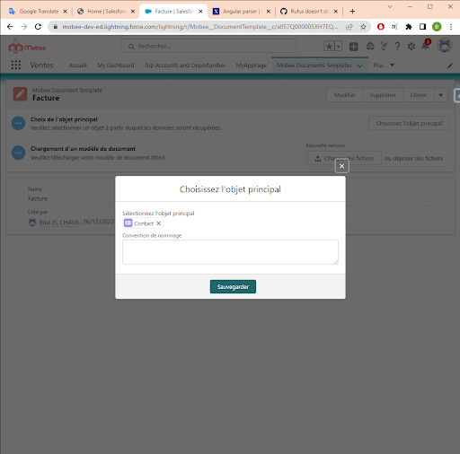

# Module de génération de documents Mobee

## Exigences et autorisations du profil utilisateur
- L'utilisateur doit avoir trois des exigences suivantes pour utiliser le module :
  - Une licence Mobee.
  - L’ensemble d’autorisations “Mobee User” ou “Mobee Administrator”.
  - L’option “Utilisateur de flux” active.

## Ajouter le bouton d'action de génération de document à une page
1. Accédez à l'objet où vous souhaitez que le bouton de génération soit disponible, puis allez dans la section "Boutons, liens et actions" pour ajouter une nouvelle action.
2. Choisissez l’option “Composant Web Lightning” pour le “Type d’action”, puis l’option “Mobee:documentGeneratorAction” pour le “Composant Web Lightning”.

<br />
1. Une fois le bouton d'action créé, vous devrez l'ajouter à une “présentation de page” de votre choix.

<br />


## Préparation du modèle word
1. Création d’un modèle de document sur Salesforce :
   - Allez sur la page "Mobee Documents Templates" pour créer un nouveau modèle.
   - Appuyez sur le bouton “Nouveau” et remplissez le nom du modèle.

<br />

   - Une fois le modèle créé, vous devrez le lier à un objet Salesforce en cliquant sur le bouton “Choisissez l’objet principal”.
   - L'objet peut être sélectionné à l'aide du champ de recherche.

<br />
   - La première étape devrait maintenant être terminée, et vous pouvez désormais télécharger votre modèle de document Word à la deuxième étape.
<br />

<br />


## Générer des documents à partir du modèle créé
1. Allez à un enregistrement du même type d'objet que le modèle de document créé.
2. Appuyez sur le bouton d'action Générer un document.
3. Sélectionnez le modèle souhaité dans la liste de sélection.
4. Le document doit être généré et téléchargé automatiquement.


<br />

## Règles d’utilisations
### Type de balises
- Le module de génération de document accepte n'importe quel document Word.
- La syntaxe des balises est inspirée de l’annotation Moustache. Les balises normales commencent par un caractère alphabétique, et les autres types de balises commencent par des préfixes spéciaux, par exemple:
  - {#boucle} et {/} pour démarrer et fermer une boucle afin de parcourir des listes de données.
- Les expressions logiques commencent aussi par le caractère “#” et acceptent les opérateurs suivants:
````md
  - ET a && b
  - OU a || b
  - ADDITION a + b
  - SOUSTRACTION a - b
  - MULTIPLICATION a * b
  - MODULO a % b
  - DIVISION a / b
  - TERNAIRES a ? b : c
  - AFFECTATION a = 1
  - ÉGALITÉ/INEQUALITY a == 1, a != 1
  - RELATIONNEL a > 1, a < 1, a >= 1, a <= 1
  - PRECEDENCE OPÉRATEUR avec parenthèse (a && b) || c
  - CHIFFRES EXPONENTIELS : 12e3 => returns 12000
- Exemple:
  - {#produits.length > 1}
    - Il existe plusieurs produits
  - {/}
  - {#firstName == "John"}
    - Bonjour John
  - {/}
  - La première condition affichera la section uniquement s'il y a 2 produits ou plus.
  - La deuxième condition affichera la section uniquement si le nom d'utilisateur est la chaîne "John".
````
### Filtres et utilitaires
Mobee offre plusieurs fonctionnalités qui aident les utilisateurs à personnaliser leurs documents.
- Afin d’avoir la date du jour, vous pouvez vous servir de la valeur “docUtils.today”.
````md
    - Today is {docUtils.today}
- Voici les filtres supportées:
  - lower: Une fonction qui convertit le texte en minuscules.
  - upper: Une fonction qui convertit le texte en majuscules.
  - shortDate: Une fonction qui renvoie la date sous un format court.
  - followingMonth: Une fonction qui renvoie le mois suivant à partir d'une date donnée.
  - followingYear: Une fonction qui renvoie l'année suivante à partir d'une date donnée.
  - lastWorkingDayOfMonth: Une fonction qui renvoie le dernier jour ouvrable du mois à partir d'une date donnée.
  - formatDate: Une fonction générale qui calcule les valeurs de date.
- Exemple d’utilisation:
  - The created date is {CreatedDate | shortDate}
  - The following month is {CreatedDate | followingMonth: '[[ "year": "numeric", "month": "long" ]]'}
  - The next year is {CreatedDate | followingYear: '[[ "year": "numeric"]]'}
  - The last working day of the month is {CreatedDate | lastWorkingDayOfMonth}
- Les fonctions followingMonth, followingYear, lastWorkingDayOfMonth et formatDate acceptent les options de formatage suivantes:
  - [[
  weekday: 'narrow' | 'short' | 'long',
  era: 'narrow' | 'short' | 'long',
  year: 'numeric' | '2-digit',
  month: 'numeric' | '2-digit' | 'narrow' | 'short' | 'long',
  day: 'numeric' | '2-digit',
  hour: 'numeric' | '2-digit',
  minute: 'numeric' | '2-digit',
  second: 'numeric' | '2-digit',
  timeZoneName: 'short' | 'long',

  // Time zone to express it in
  timeZone: 'Asia/Shanghai',
  // Force 12-hour or 24-hour
  hour12: true | false,

  // Rarely-used options
  hourCycle: 'h11' | 'h12' | 'h23' | 'h24',
  formatMatcher: 'basic' | 'best fit'
]]
````
