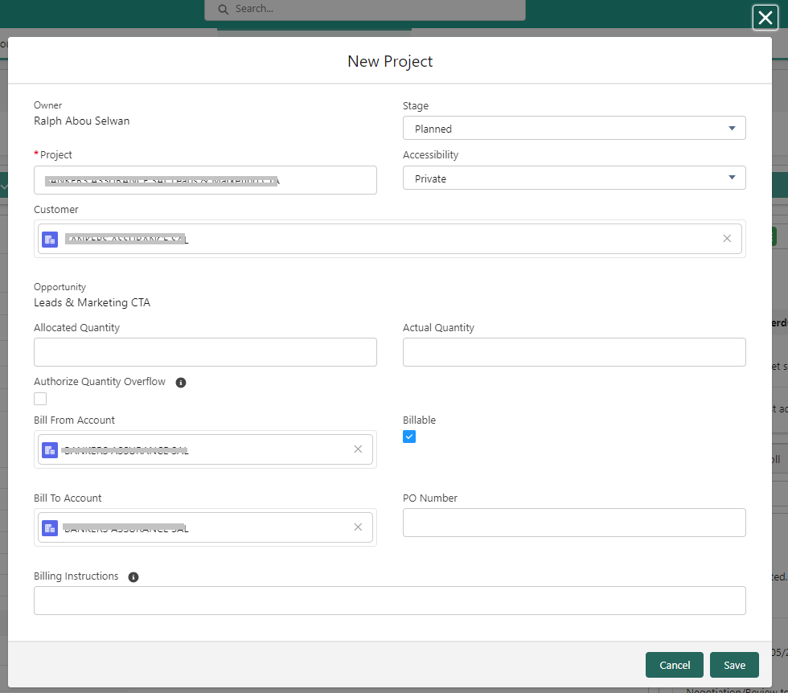
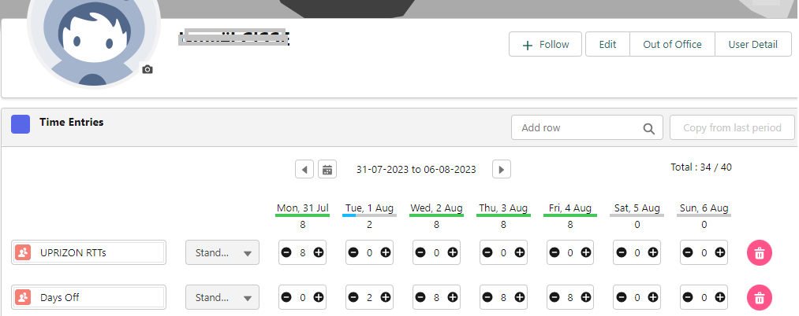

## Introduction

Ce guide d'utilisateur vous aidera à comprendre et utiliser les fonctionnalités de gestion des Time Entries dans notre système. 

Vous y trouverez des instructions étape par étape pour ajouter de nouveaux projets et affectations, ainsi que pour consulter les Time Entries de vos collègues.

## Ajouter un nouveau projet à partir d'une opportunité

### Naviguer vers l'opportunité
Étape 1: Accéder au module "Opportunités"

1. Connectez-vous à votre compte Salesforce.
2. Accédez à la page d'accueil de Salesforce.
3. Dans la barre de navigation supérieure, cliquez sur l'onglet "Opportunités" pour ouvrir la liste des opportunités.
4. Choisissez l'opportunité concernée.

Étape 2:  Clique sur le bouton du toolbar “New Project”, pour créer un projet à partir de l’opportunité. 

Le système lancera une boîte de dialogue avec les variables initiées à partir de l'opportunité comme suit: à compléter selon vos besoins.

Le formulaire "New Project" est présenté à l’utilisateur , avec beaucoup de champs pré-remplis à partir de l'opportunité. Cela permet de faciliter la saisie et réduit ainsi les erreurs.

## Ajouter un nouvel "Assignment" à partir du projet

### Naviguer vers le projet concerné

Étape 1 : Accéder à la page du projet

1. Accédez à la liste des projets en cliquant sur l'onglet "Projets" dans la barre de navigation supérieure.
2. Sélectionnez le projet auquel vous souhaitez ajouter un nouvel "Assignment".

Étape 2 : Ajouter un nouvel "Assignment"
* Dans la page du projet concerné.
* Cliquez sur le bouton "New Assignment" pour créer une nouvelle affectation.
* Remplissez les détails de l'affectation, tels que le nom de l'assigné, prix, quantité, la description du travail, la date de début et de fin, etc.
* Enregistrez l'affectation nouvellement créée.

        
Le formulaire "New Assignment" est présenté à l'utilisateur, avec beaucoup de champs pré-remplis à partir du projet. Cela permet de faciliter la saisie et réduit ainsi les erreurs.

## Consulter les "Time Entries" des collègues utilisateurs "Salesforce Community"

### Naviguer vers le contact concerné

Chaque Chaque collégue utilisateur “Salesforce Communité”  est créer comme Contact dans Salesforce.

Étape 1 : Accéder aux "Contacts"

* Accédez à la liste des contacts en cliquant sur l'onglet "Contacts" dans la barre de navigation supérieure.
* Sélectionnez le contact (le collégue)  auquel vous souhaitez consulter  les “Time entries”.
* Utilisez le filtre disponible dans la page de contact.
* La page Contact est affiché avec les détails.

Étape 2 : Accéder aux "Time Entries".

* Les “Time entries” sont affichés dans l’onglet:

## Consulter les "Time Entries" des collègues utilisateurs "Standard Salesforce"

### Utiliser la barre de recherche globale. 

* Saisir le nom du collègues dans la zone de recherche. Une liste vous donne les utilisateurs répondant aux criteres et ainsi que la nature de l’objet trouvé (Account, Contact, User etc).
* Choisir “User” , et le système va vous dirigera vers l’utilisateur concerné.
* Le timesheet sera affiché au début de la page comme suit:

